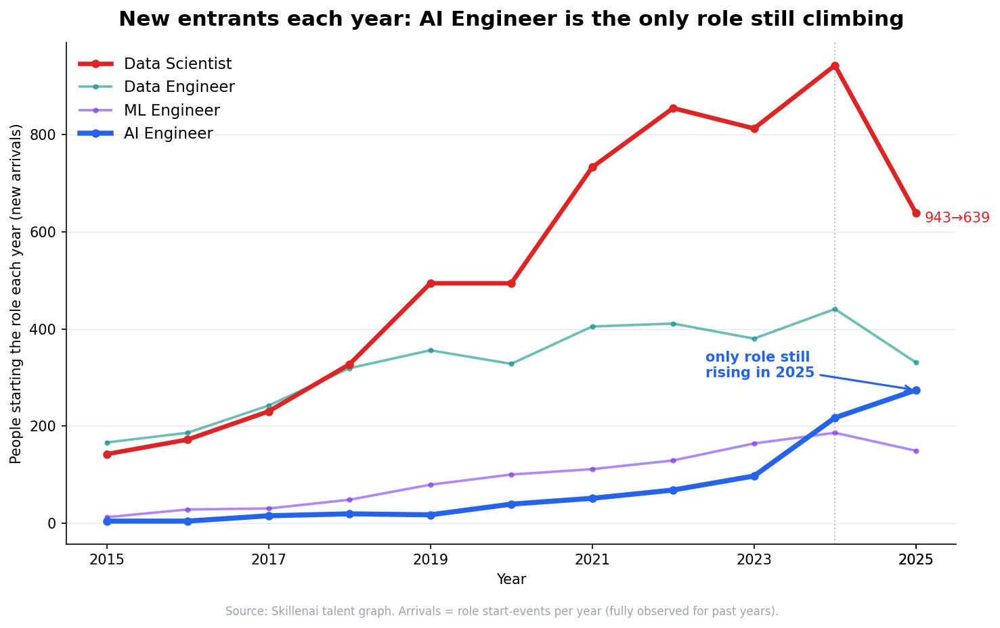
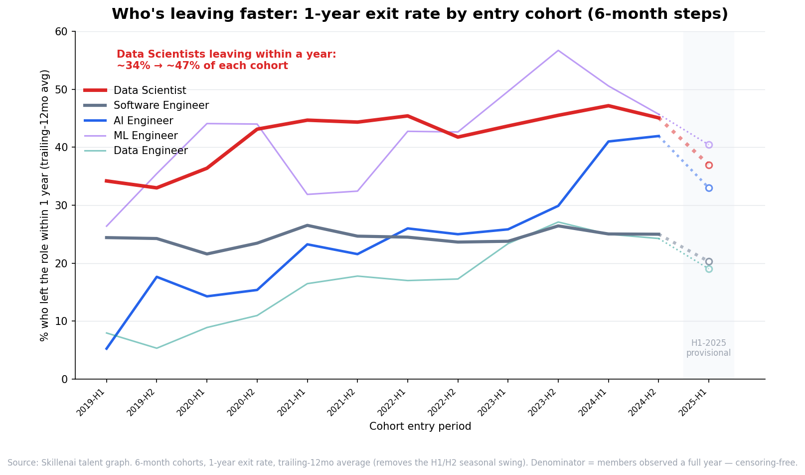
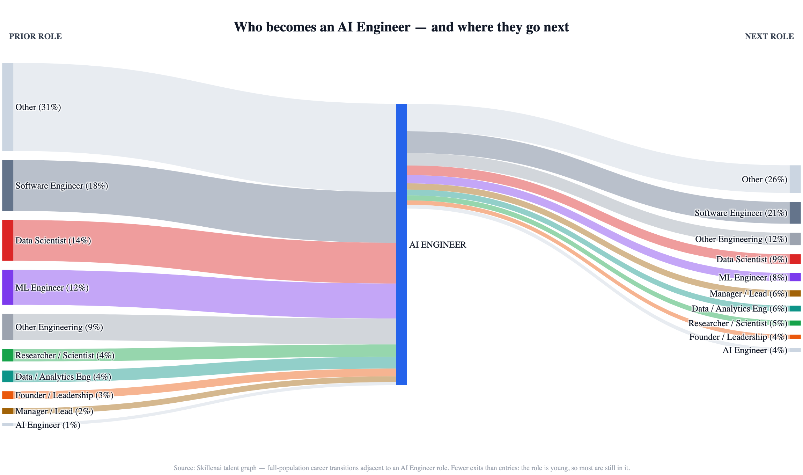

# Who Becomes an AI Engineer — and Why It's the Only Tech Role Still Climbing

*A Skillenai analysis. 2026.*

**Data.** Two Skillenai sources:
- **Supply** — the Skillenai **talent graph**: millions of professional career histories with dated, role-to-role transitions (who holds which title, and how people move between roles over time). Tech/AI-focused sample.
- **Demand** — the Skillenai **job-postings index**: what employers advertise for (titles, skills, salaries).

Together they let us watch the AI Engineer role from both sides at once: how fast people are moving into it, which roles feed it, where its people go next, and the skills that set it apart.

---

## TL;DR

- **AI Engineer is the only role among its neighbors where new entrants are still rising** — its yearly arrivals grew 97 → 217 → 274 across 2023–25, while Data Scientist, Data Engineer, and ML Engineer arrivals all *peaked in 2024 and fell in 2025*.
- **Data Scientists are also leaving faster.** The share of each Data Scientist cohort that exits the role within a year climbed from **~34% to ~47%** over 2019–24, while Software Engineering held flat at ~24%. Fewer coming in, more going out.
- **It's a distinct job, not a rename.** On the workers themselves, AI Engineers carry an LLM/agent/RAG skill signature (LLM 29%, RAG 22%, agents 17%, LangChain 16%) that Data Scientists (statistics 32%, LLM 7%) and Software Engineers (LLM 2%) don't.
- **It's a genuine transition.** Software Engineers are the largest identifiable feeder in; people flow back out to ML/research or up into founder/leadership roles.
- **It pays like a premium software engineer** — ~$190K median midpoint, above Data Science, below the ML specialist.

---

## 1. New entrants: AI Engineer is the only role still climbing

Each role is measured by its yearly **arrivals** — how many people *start* the role that year, read straight off dated career histories. Arrivals are fully observed for past years, which makes this the cleanest growth signal.

- **AI Engineer** climbs relentlessly and is the **only role whose entrants are still rising in 2025.**
- **Data Scientist** grew for a decade, peaked in 2024, and dropped sharply in 2025 (943 → 639 new entrants).
- **Data Engineer** and **ML Engineer** show the same 2024 peak and 2025 fade.

## 2. The other side of the flow: who's leaving faster

Arrivals are only half the story. The other half — departures — we read with a **fixed-lookahead cohort** method that sidesteps the usual snapshot bias: for each entry cohort we ask what share left the role *within one year*, counting only people who've actually had a full year to be observed. That's censoring-free and needs no future data. We bucket cohorts in 6-month steps and plot a trailing-12-month average (job changes cluster seasonally, so raw half-year points swing ~10 points H1-vs-H2; the rolling average removes that).

- **Data Scientist** cohorts leave within a year at a **rising rate — ~34% climbing to ~47%** across 2019–2024.
- **Software Engineering** is flat at **~24%** — the stable-role reference.
- **AI Engineer** churn climbs steeply as the role matures (5% → 42%), but its arrivals dwarf it.

Put the two sides together: **Data Scientist is the one role with fewer people arriving *and* more leaving within a year** — a genuine squeeze, visible today with no waiting. (The H1-2025 point is shown faded/provisional: that cohort's within-year exits run into 2026 and are still being reported.)

## 3. A different job, not a rename

If AI Engineer were just Data Science or ML relabeled, the skills would match. Measured on the **workers' own profiles** (not job ads):

- **AI Engineers own the LLM-native stack:** LLM 29%, RAG 22%, agents 17%, LangChain 16%, fine-tuning 17% — multiples of every neighbor.
- **Data Scientists own statistics** (32%) and barely touch the LLM stack (7%).
- **Software Engineers** register near-zero on all of it.

Moving into AI Engineering is real reskilling. (Profile text is sparser than a job ad, so these rates run lower than posting-based skill demand — but the *relative* fingerprint is unmistakable.)

## 4. Who becomes an AI Engineer — and where they go next

Because we hold full career histories, we can trace every transition adjacent to an AI Engineer role across the whole population:

- **In:** among identifiable prior roles, **Software Engineer leads (18%)**, then **Data Scientist (14%)** and **ML Engineer (12%)**, with a long tail of other backgrounds.
- **Out:** people leave for **Software Engineering (21%)**, other engineering, **Data Science (9%)** and **ML (8%)**, or step up into **manager/lead and founder** roles.

There are fewer exits than entries here for a simple reason: the role is young, so most people who've become AI Engineers are still in it.

## 5. The pay

AI Engineer advertises like a **premium software engineer**: ~$190K median midpoint, above Data Science (~$173K), level with Software Engineering (~$187K), below the ML Engineering specialist (~$210K). A Data Scientist moving into AI Engineering typically gets a raise; a Software Engineer moves roughly sideways into a hotter market.

---

## What this means

- **Software engineers and data scientists:** AI Engineering is the highest-momentum move available — the one neighboring role where new entrants are still climbing while the rest have flattened. It's a genuine skill shift (LLMs, RAG, agents, prompt engineering), and for data scientists it usually comes with a pay bump.
- **Data scientists specifically:** the classic title has stopped growing and its people are leaving faster. The underlying skills — statistics, experimentation — remain rare and valuable, but the *label* is no longer where the growth is.
- **Hiring managers:** you're recruiting AI Engineers out of the software and ML/data pools, not a graduate pipeline, in the tightest corner of the tech market.

---

## Methodology & caveats

- **Two instruments.** Supply-side flows and skills come from the Skillenai talent graph (dated career histories); salary comes from the Skillenai job-postings index (advertised base bands). They measure different things and are reported separately.
- **Role spells.** For each person we read role **spells** from their dated experience (consecutive positions in the same role are merged, so changing companies within a role doesn't count as leaving it). Arrivals = spell starts per year.
- **Arrivals are censoring-immune.** A role-start is a fully-observed past event, so the arrivals trend (Fig. 1) is the clean measure of who's moving *into* a role — including 2025.
- **Departures via fixed-lookahead cohorts.** Naïvely dividing arrivals by same-window departures overstates growth for any recent period, because people who just arrived haven't left yet. We avoid this entirely: for each entry cohort we measure the exit rate over a **fixed horizon** (1 year), restricting the denominator to members who have actually had that full horizon to be observed before the snapshot. This is equivalent to "rewinding the clock" and reading each cohort's outcome once it has matured — fully observed and comparable across cohorts, with no future snapshot required. Cohorts are bucketed in **6-month steps**; because job changes cluster seasonally (H1-start cohorts show a ~10-point higher 1-year exit rate than H2), we plot a **trailing-12-month average** to remove the sawtooth. The series is reliable through the 2024 cohorts; **H1-2025 is shown provisional** (its within-year exits extend into 2026 and are still being reported), and H2-2025+ is omitted (not yet observed a full year).
- **Sample.** This is a tech-focused sample of the full labor market, not a census — report trends and ratios; treat absolute counts as sample estimates. Role sample sizes (current workers): Software Engineer ~36.7K, Data Scientist ~4.6K, Data Engineer ~3.3K, AI Engineer ~665, ML Engineer ~600. Thin roles (AI Engineer, ML Engineer) carry wider uncertainty.
- **Roles are title-resolved** with fuzzy matching (e.g. "AI Engineer" also captures "Senior/Generative/Applied AI Engineer"), then spell-merged. Education and undated entries are stripped.
- **Skill fingerprint** counts the share of a role's workers whose profile text (`about` + role descriptions) mentions each skill — a self-reported measure, sparser than job-ad skill demand.
- **Out-of-workforce attrition** (people who fully leave the tracked labor market) is not a role-to-role transition and isn't captured as such.

*Result tables are included as CSVs in this folder; `make_figures.py` regenerates every figure.*
