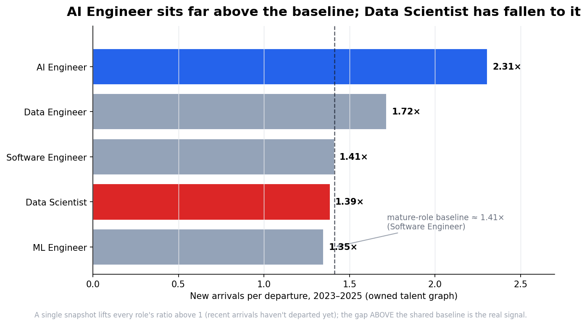

# Who Becomes an AI Engineer — and Why It's the Only Tech Role Still Climbing

*A Skillenai analysis. 2026.*

**Data.** Two Skillenai sources:
- **Supply** — the Skillenai **talent graph**: millions of professional career histories with dated, role-to-role transitions (who holds which title, and how people move between roles over time). Tech/AI-focused sample.
- **Demand** — the Skillenai **job-postings index**: what employers advertise for (titles, skills, salaries).

Together they let us watch the AI Engineer role from both sides at once: how fast people are moving into it, which roles feed it, where its people go next, and the skills that set it apart.

---

## TL;DR

- **AI Engineer is the only role among its neighbors where new entrants are still rising** — its yearly arrivals grew 97 → 217 → 274 across 2023–25, while Data Scientist, Data Engineer, and ML Engineer arrivals all *peaked in 2024 and fell in 2025*.
- **It's the clear net-flow outlier.** New-arrivals-per-departure sits at **2.31×**, far above the ~1.4× baseline shared by mature roles. **Data Scientist has fallen *to* that baseline (1.39×)** — its growth premium is gone.
- **It's a distinct job, not a rename.** On the workers themselves, AI Engineers carry an LLM/agent/RAG skill signature (LLM 29%, RAG 22%, agents 17%, LangChain 16%) that Data Scientists (statistics 32%, LLM 7%) and Software Engineers (LLM 2%) don't.
- **It's a genuine transition.** Software Engineers are the largest identifiable feeder in; people flow back out to ML/research or up into founder/leadership roles.
- **It pays like a premium software engineer** — ~$190K median midpoint, above Data Science, below the ML specialist.

---

## 1. New entrants: AI Engineer is the only role still climbing

Each role is measured by its yearly **arrivals** — how many people *start* the role that year, read straight off dated career histories. Arrivals are fully observed for past years, which makes this the cleanest growth signal.

- **AI Engineer** climbs relentlessly and is the **only role whose entrants are still rising in 2025.**
- **Data Scientist** grew for a decade, peaked in 2024, and dropped sharply in 2025 (943 → 639 new entrants).
- **Data Engineer** and **ML Engineer** show the same 2024 peak and 2025 fade.

## 2. The net-flow outlier — read against the baseline

Net flow = arrivals minus departures. In any point-in-time view, *every* role's arrivals-per-departure ratio sits above 1.0, because people who just entered a role haven't left it yet. So the number to read isn't the absolute ratio — it's the **gap above the shared baseline** that mature roles settle at.

Software Engineering — a large, mature role — anchors that baseline at **~1.41×**. Against it:
- **AI Engineer: 2.31×** — far above baseline. Real, large excess growth.
- **Data Scientist: 1.39×** — *at* the mature-role baseline. No excess growth left.
- ML Engineer (1.35×) sits at baseline; Data Engineer (1.72×) modestly above.

**AI Engineer has a big growth premium; Data Scientist's has evaporated.**

## 3. A different job, not a rename

If AI Engineer were just Data Science or ML relabeled, the skills would match. Measured on the **workers' own profiles** (not job ads):

- **AI Engineers own the LLM-native stack:** LLM 29%, RAG 22%, agents 17%, LangChain 16%, fine-tuning 17% — multiples of every neighbor.
- **Data Scientists own statistics** (32%) and barely touch the LLM stack (7%).
- **Software Engineers** register near-zero on all of it.

Moving into AI Engineering is real reskilling. (Profile text is sparser than a job ad, so these rates run lower than posting-based skill demand — but the *relative* fingerprint is unmistakable.)

## 4. Who becomes an AI Engineer — and where they go next

Because we hold full career histories, we can trace every transition adjacent to an AI Engineer role across the whole population:

- **In:** among identifiable prior roles, **Software Engineer leads (18%)**, then **Data Scientist (14%)** and **ML Engineer (12%)**, with a long tail of other backgrounds.
- **Out:** people leave for **Software Engineering (21%)**, other engineering, **Data Science (9%)** and **ML (8%)**, or step up into **manager/lead and founder** roles.

There are fewer exits than entries here for a simple reason: the role is young, so most people who've become AI Engineers are still in it.

## 5. The pay

AI Engineer advertises like a **premium software engineer**: ~$190K median midpoint, above Data Science (~$173K), level with Software Engineering (~$187K), below the ML Engineering specialist (~$210K). A Data Scientist moving into AI Engineering typically gets a raise; a Software Engineer moves roughly sideways into a hotter market.

---

## What this means

- **Software engineers and data scientists:** AI Engineering is the highest-momentum move available — the one neighboring role still hiring hard while the rest sit at replacement. It's a genuine skill shift (LLMs, RAG, agents, prompt engineering), and for data scientists it usually comes with a pay bump.
- **Data scientists specifically:** the classic title has stopped outgrowing the baseline. The underlying skills — statistics, experimentation — remain rare and valuable, but the *label* is no longer where the growth is.
- **Hiring managers:** you're recruiting AI Engineers out of the software and ML/data pools, not a graduate pipeline, in the tightest corner of the tech market.

---

## Methodology & caveats

- **Two instruments.** Supply-side flows and skills come from the Skillenai talent graph (dated career histories); salary comes from the Skillenai job-postings index (advertised base bands). They measure different things and are reported separately.
- **Net flow from dated role spells.** For each person we read role **spells** from their dated experience (consecutive positions in the same role are merged, so changing companies within a role doesn't count as leaving it). Arrivals = spell starts per year; departures = spell ends.
- **Snapshot censoring — read the baseline, not the absolute.** A point-in-time view can't yet see the future departures of recent arrivals, so every role's arrivals-per-departure ratio is lifted above 1.0. We therefore anchor to the mature-role (Software Engineer) baseline and read the gap above it; we do not report a single role's ratio *across* time, which is dominated by how young the role is rather than by real dynamics.
- **Arrivals are the robust signal.** Past-year arrivals are fully observed; the most recent year can carry mild reporting lag as histories update.
- **Sample.** This is a tech-focused sample of the full labor market, not a census — report trends and ratios; treat absolute counts as sample estimates. Role sample sizes (current workers): Software Engineer ~36.7K, Data Scientist ~4.6K, Data Engineer ~3.3K, AI Engineer ~665, ML Engineer ~600. Thin roles (AI Engineer, ML Engineer) carry wider uncertainty.
- **Roles are title-resolved** with fuzzy matching (e.g. "AI Engineer" also captures "Senior/Generative/Applied AI Engineer"), then spell-merged. Education and undated entries are stripped.
- **Skill fingerprint** counts the share of a role's workers whose profile text (`about` + role descriptions) mentions each skill — a self-reported measure, sparser than job-ad skill demand.
- **Out-of-workforce attrition** (people who fully leave the tracked labor market) is not a role-to-role transition and isn't captured as such.

*Result tables are included as CSVs in this folder; `make_figures.py` regenerates every figure.*
