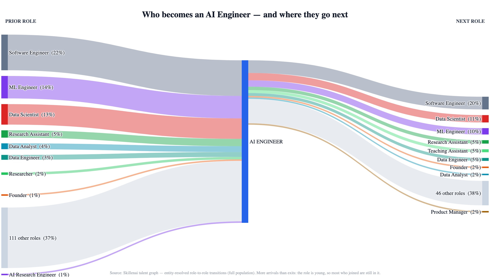
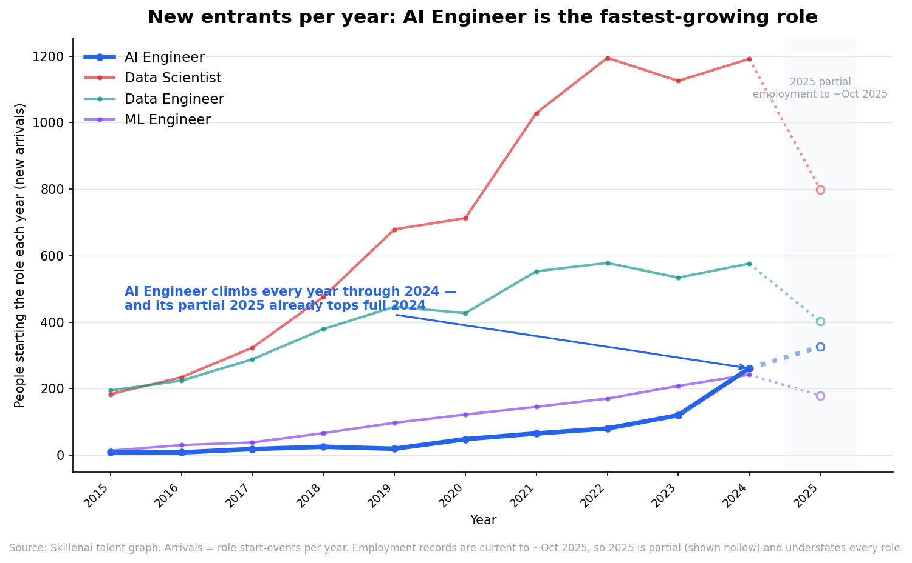
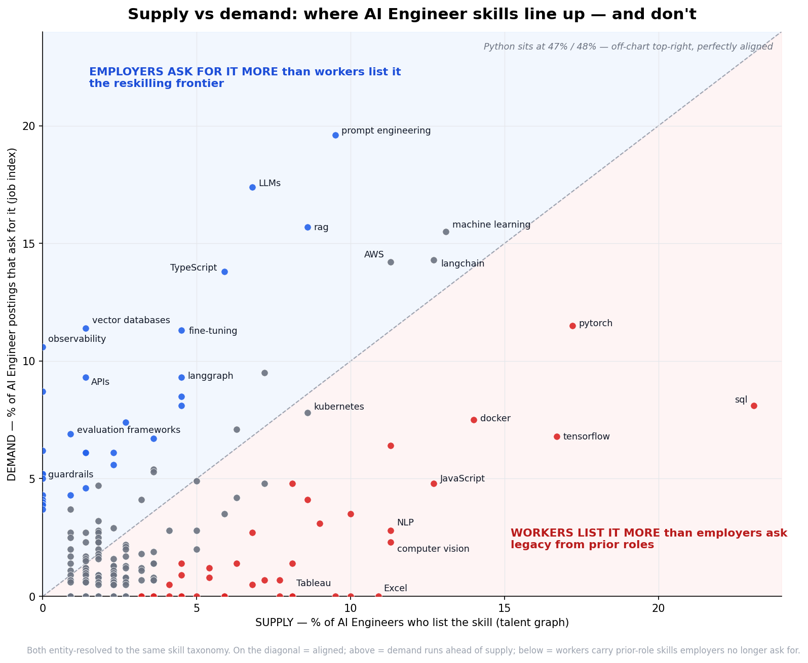
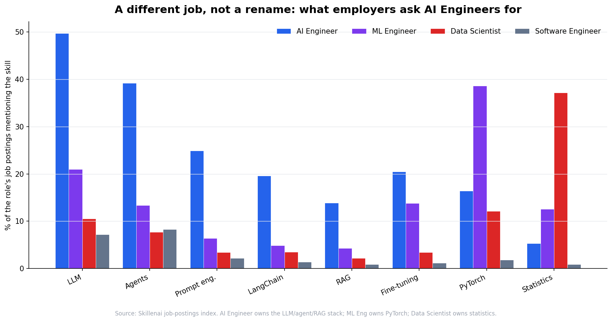
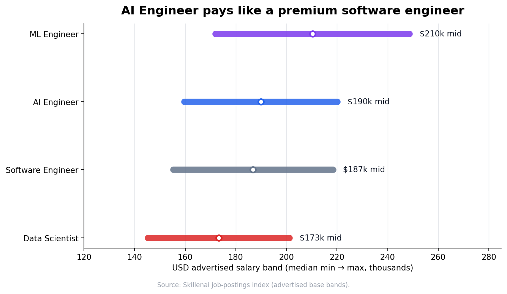

# Who Becomes an AI Engineer — and Where They Go Next

*A Skillenai analysis. 2026.*

**Data.** Two Skillenai sources:
- **Supply** — the Skillenai **talent graph**: millions of professional career histories with dated, **entity-resolved** role-to-role transitions (roles are normalized to canonical entities, so a move is *Software Engineer → AI Engineer*, not a keyword guess).
- **Demand** — the Skillenai **job-postings index**: what employers advertise for (skills, salaries).

Together they answer: who moves *into* the AI Engineer role, where its people go *next*, how fast newcomers are arriving, and what makes the job distinct.

---

## TL;DR

- **AI Engineer sits at the crossroads of software and data.** Its biggest feeders are **Software Engineer (22%), ML Engineer (14%), and Data Scientist (13%)** — together nearly half of all identifiable moves in. The rest is a genuinely long tail of 100+ other backgrounds (Research Assistant, Data Analyst, Data Engineer, founders, academics).
- **The same roles are where AI Engineers go next** (Software Engineer 20%, Data Scientist 11%, ML Engineer 10%) — plus academia and founder/leadership. It's a two-way interchange with the rest of tech.
- **Far more arrive than leave** — the role is young, so most who've joined are still in it.
- **New entrants are accelerating** — AI Engineer arrivals steepened every year through 2024 (…80 → 120 → 261), and even a *partial* 2025 (employment records current to ~Oct 2025) already tops its full 2024. The adjacent roles (Data Scientist, Data Engineer, ML Engineer) plateaued over the same window.
- **It's a distinct job, not a rename** — its postings demand an LLM/agent/RAG skill stack the neighboring roles don't.
- **Supply hasn't caught up to demand.** Putting both sides on one taxonomy: employers ask 2–8× more than workers list for the LLM-production stack (LLMs, prompt engineering, RAG, vector DBs, evaluation, guardrails), while workers over-list the legacy skills of their prior roles (SQL, Excel, TensorFlow, computer vision). The skill gap is the fingerprint of the career transition itself.

---

## 1. Who becomes an AI Engineer — and where they go next

Because roles in the talent graph are entity-resolved, we can trace every role-to-role transition adjacent to an AI Engineer role across the whole population — and name both ends.

- **In:** **Software Engineer (22%)** is the single largest feeder, then **ML Engineer (14%)** and **Data Scientist (13%)**. After that comes a real spread of backgrounds — Research Assistant (5%), Data Analyst (4%), Data Engineer (3%), and a long tail of 100+ other roles. AI Engineering pulls from across software, ML/data, *and* academia.
- **Out:** the same three lead the exits (Software Engineer 20%, Data Scientist 11%, ML Engineer 10%), alongside academia (Research/Teaching Assistant) and founder/leadership.

Two things worth stating plainly:
1. **The big "other" slice is real diversity, not a labeling artifact.** Earlier keyword bucketing dumped a third of moves into an unnamed "Other." Entity resolution names them — it's ~110 distinct roles each contributing a handful of moves (Solutions Engineer, Business Analyst, IoT Engineer, Consultant, Lecturer, and so on). No single hidden role was lurking there.
2. **Arrivals outnumber exits ~2.5-to-1.** That's what a young, still-filling role looks like: most people who became AI Engineers haven't moved on yet.

## 2. New entrants are still climbing

Arrivals — the count of people *starting* the role each year — are fully observed for past years, which makes them the clean measure of momentum.

- **AI Engineer** arrivals **accelerated through 2024** (65 → 80 → 120 → 261 across 2021–24) — the steepest climb of the group. Its 2025 point is partial (employment records current to ~Oct 2025) yet already exceeds full 2024, so true 2025 is higher still.
- **Data Scientist, Data Engineer, and ML Engineer plateaued** over 2022–24 — larger in absolute terms, but their year-over-year growth had flattened before the window closed.
- **Don't read the 2025 dips as decline.** 2025 is a partial year for *every* role (employment history in this snapshot ends ~Oct 2025), so all lines fall artificially at the hollow point — that's the data window closing, not the market.

## 3. Supply and demand don't line up on skills

This is the first analysis where we can put both sides on the same axes: what AI Engineers **list on their profiles** (supply) vs what AI Engineer **postings ask for** (demand) — every skill entity-resolved to the same taxonomy.

The core lines up, but the two ends diverge in opposite directions:

- **On the diagonal — the settled core.** Python (48% demand / 47% supply), machine learning, LangChain, AWS, Kubernetes, CI/CD. Both sides agree on the base.
- **Above — demand runs ahead (the reskilling frontier).** Employers ask 2–8× more than workers list for the LLM-*production* stack: **LLMs (17% vs 7%), prompt engineering (20% vs 9%), RAG (16% vs 9%), vector databases (11% vs 1%), fine-tuning, evaluation, guardrails, observability** (the last three near-absent from profiles). These are the role's *defining* skills — and the workforce hasn't caught up to signaling them.
- **Below — supply carries legacy weight.** Workers list, far more than employers now ask, the toolkits of the roles they came *from*: **SQL, Excel, Tableau, Power BI** (Data Analyst), **TensorFlow, computer vision, OpenCV, NLP** (ML / Data Science), **HTML/CSS/JavaScript** (Software Engineer).

**The gap is the fingerprint of the transitions.** The over-supplied skills map almost one-to-one onto the Sankey's top feeders — analysts bring SQL/Excel, ML/DS people bring TensorFlow/CV, software engineers bring web skills — while the market pulls everyone toward an LLM-ops stack none of them list yet. People arrive carrying where they came from; demand points where the role is going.

## 4. A different job, not a rename

The gap above is *within* AI Engineering. Across roles, the distinction is just as sharp — the postings demand a stack the neighbors don't:

- **AI Engineer** owns the LLM/agent stack: **LLM 50%, agents 39%, prompt engineering 25%, LangChain 20%, RAG 14%** — multiples of any neighbor.
- **ML Engineer** owns PyTorch (39%); **Data Scientist** owns statistics (37%).

So moving in from Software Engineering or Data Science is real reskilling — exactly what the Sankey shows people doing, and exactly the frontier the supply–demand gap says they're climbing.

## 5. The pay

AI Engineer advertises like a **premium software engineer**: ~$190K median midpoint — above Data Science (~$173K), level with Software Engineering (~$187K), below the ML Engineering specialist (~$210K).

---

## What this means

- **Software engineers and data scientists:** AI Engineering is the highest-momentum move on the board, and the graph shows your peers already making it. It's genuine reskilling into an LLM/agent/RAG stack, not a title swap.
- **Anyone eyeing the field:** there's no single "right" background. Software, ML, data science, analytics, and even academia all feed it.
- **Hiring managers:** you're recruiting AI Engineers out of the software and ML/data pools (and a wide tail beyond), not a graduate pipeline.

---

## Methodology & caveats

- **Roles are entity-resolved.** The talent graph normalizes free-text titles to canonical role entities; the Sankey is built from the resolved **role-to-role transition matrix** (full population), so prior/next roles are named entities, not keyword buckets. The **AI Engineer** node aggregates the AI-engineer role family (AI Engineer, Generative / Applied / AI-ML / LLM Engineer, and its seniority variants); moves *within* that family are excluded so the flows show genuine cross-role movement. Synonymous destinations (e.g. "Machine Learning Engineer" / "ML Engineer") are merged for display.
- **"N other roles"** rolls up the long tail of distinct resolved roles that each contribute only a few moves — genuine diversity, shown as one node for legibility.
- **Arrivals** count role start-events per year (spell-level: consecutive same-role positions merged, so a company change within a role isn't a new arrival; multiple roles at one employer, which LinkedIn nests, are all counted). A start date is a fully-observed past event, so the trend doesn't depend on future events — **but** the snapshot's **employment (experience) records are current to ~Oct 2025** (other profile fields extend later), so 2025 is a **partial year** — every role's 2025 is understated. Treat 2025 as provisional (shown hollow) and read the trend through 2024.
- **The supply–demand skill comparison** puts both sides on the same entity-resolved skill taxonomy. **Demand** = % of AI Engineer *postings* whose resolved skills include the skill (job index, ~4,300 postings). **Supply** = % of AI Engineers whose *profile* lists it (talent graph, resolved skills, n≈220 observed). Different text sources (recruiter-written postings vs self-reported profiles), same resolver — so positions are comparable but the *levels* reflect each medium. A near-zero supply reading means below the profile-extraction threshold, not literally zero; profiles under-report operational skills people may actually practice.
- **The cross-role skill fingerprint and salary are demand-side**, from the job-postings index (skill = % of a role's postings mentioning it; salary = advertised base bands).
- **Sample.** The talent graph is a tech-focused sample, not a census — read the composition and trends; treat absolute move-counts as sample estimates. AI Engineer is young and its transition counts are modest (hundreds of resolved moves), so the tail percentages carry real uncertainty; the top feeders/exits are the robust part.
- **Not measured:** exits out of the tracked workforce entirely, and the eventual destinations of very recent (2025+) entrants, most of whom are still in the role.
