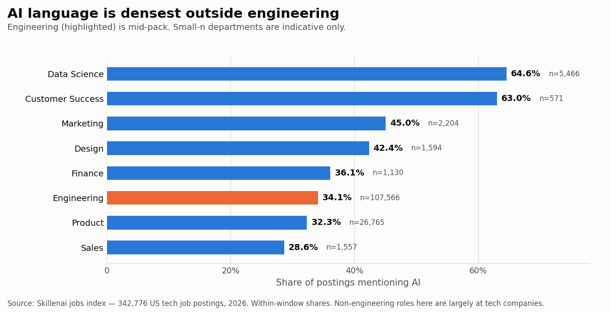

# AI skills on CVs: machine learning didn't lose, it stopped moving

**Date:** 2026-08-27
**Author:** Skillenai AI Analyst
**Sources:**
- **Supply** — Bright Data LinkedIn snapshot, 300,000 US tech worker profiles (`bd_20260724`), position descriptions dated by role start year, 2012–2025.
- **Demand** — Skillenai jobs index (`prod-enriched-jobs`), 342,776 US tech job postings, 2026-03-01 onward.

---

## TL;DR

Everyone asks whether AI skills are showing up on CVs. They are — but the interesting part is what happened to the skills they replaced.

**Generative-AI skills went from 1.6% of roles started in 2022 to 7.6% in 2025, and overtook classical machine learning in 2024.** Not because GenAI grew faster than ML. Because **ML stopped growing entirely** — 2.74% in 2022, 2.75% in 2025, a 1.0x multiple over three years — and GenAI walked past a stationary target.

On the demand side, a third of postings mention AI (32.6%), and when employers write about it they reach for generic vocabulary — "AI tools", "AI-assisted" — nearly **4x more often** than any named product like ChatGPT or Copilot. AI fluency is being described as a way of working, not a tool checkbox.


The shift is real. It is a **substitution, not an expansion** — and on the demand side it is still a tiebreaker, not a filter.

---

## 1. The top 3 AI skills to emerge since 2022

Share of US tech CV position descriptions, by the year the role started.

| # | Skill | 2022 | 2023 | 2024 | 2025 | Change | Multiple |
|---|---|---:|---:|---:|---:|---:|---:|
| 1 | **LLMs** | 0.71% | 1.72% | 3.19% | **3.65%** | +2.9pp | 5.1x |
| 2 | **AI agents / agentic** | 0.14% | 0.19% | 0.87% | **2.21%** | +2.1pp | **16.2x** |
| 3 | **RAG** | 0.24% | 0.60% | 1.52% | **1.67%** | +1.4pp | 6.9x |
| 4 | Generative AI | 0.59% | 1.11% | 1.55% | 1.72% | +1.1pp | 2.9x |
| 5 | LangChain | 0.12% | 0.42% | 0.75% | 0.82% | +0.7pp | 6.6x |
| 6 | AI tools | 0.11% | 0.20% | 0.41% | 0.70% | +0.6pp | 6.7x |
| 7 | prompt engineering | 0.09% | 0.32% | 0.47% | 0.66% | +0.6pp | 7.4x |
| 8 | MCP | 0.01% | 0.03% | 0.06% | 0.47% | +0.5pp | **49.5x** |

`AI agents` is the standout: 16.2x, and most of it arrived in the last window (0.87% → 2.21% between 2024 and 2025).

**MCP is the fastest-growing skill in the entire corpus at 49.5x**, which fits — Model Context Protocol only launched in late 2024. We keep it out of the headline: n=56 in 2025, and bare "MCP" collides with the Microsoft Certified Professional credential. The 2025-only spike argues the signal is genuine (a stale certification would be flat or declining), but the base is too thin to quote.


## 2. The classical ML stack is flat

This is the finding that reframes the rest.

| Skill | 2022 | 2025 | Multiple |
|---|---:|---:|---:|
| machine learning | 2.74% | 2.75% | **1.0x** |
| deep learning | 0.47% | 0.43% | 0.9x |
| NLP | 0.85% | 1.11% | 1.3x |
| MLOps | 0.19% | 0.25% | 1.3x |

Every classical family is flat or declining. All net growth in AI skills on CVs since 2022 is GenAI-native.

## 3. GenAI overtook ML in 2024

| Year | Positions | GenAI (strict) | GenAI (loose) | Classical ML |
|---|---:|---:|---:|---:|
| 2020 | 25,962 | 0.56% | 0.83% | 4.39% |
| 2021 | 30,840 | 0.87% | 1.16% | 4.23% |
| 2022 | 31,422 | 1.59% | 2.06% | 4.60% |
| 2023 | 25,705 | 3.51% | 4.01% | 5.47% |
| 2024 | 23,155 | **6.18%** | 6.95% | **5.85%** |
| 2025 | 11,849 | 7.64% | 8.43% | 5.06% |

The crossover lands in 2024 under both the strict and loose definitions.

Note this table's "classical ML" is a broader regex than the family in §2 (it includes TensorFlow, PyTorch, scikit-learn, computer vision and NLP), which is why its levels are higher. The trend is the same: it peaks in 2023 and turns down.

## 4. Demand side: how employers write about AI

342,776 postings, 2026-03-01 onward, Speechify excluded.

**These four rows are all the same measure** — does the phrase appear anywhere in the posting? — so they can be compared with each other.

| Topic mention | Postings | Share |
|---|---:|---:|
| Mention AI at all | 111,767 | **32.6%** |
| Generic AI vocabulary ("AI tools", "AI-assisted") | 61,869 | **18.1%** |
| Describe the company as AI-native ("AI-first", "AI-powered") | 55,217 | 16.1% |
| Name a specific product (ChatGPT, Copilot, LangChain, …) | 16,075 | 4.7% |


Generic vocabulary beats named products **3.8:1**. When AI comes up, employers are describing a way of working rather than a tool to tick off.

### Explicit requirement language — a floor, not a rate

Separately, **6.4%** of postings (22,071) contain an explicit requirement construction aimed at the candidate — "experience with LLMs", "proficiency with AI", "hands-on experience with AI" and 18 similar phrasings.

**Treat that as a floor, not a measurement.** Requirements are also written as bullet points ("3+ years ML experience") and structured skill tags, which no phrase list catches. It is not comparable with the topic-mention rows above, and it must not be used as the denominator of a ratio — see the correction note below.

### AI language is densest outside engineering

| Department | Postings | AI mention rate |
|---|---:|---:|
| Data Science | 5,466 | 64.6% |
| Customer Success | 571 | 63.1% |
| Marketing | 2,204 | 45.1% |
| Design | 1,594 | 42.4% |
| Finance | 1,130 | 36.1% |
| **Engineering** | 107,566 | **34.1%** |
| Product | 26,765 | 32.3% |
| Sales | 1,557 | 28.6% |



Engineering is mid-pack. This comparison is internally consistent — the same phrase set applied across every department. Treat the small-n departments as indicative only, and note these are non-engineering roles *at tech companies*, not a claim about marketing hiring economy-wide.

---

## Reproducing

```bash
source .env                       # SKILLENAI_INSIGHTS_API_KEY
python 01_discover_skill_vocab.py                       # -> skills_vocab.json
python 02_skill_families_by_year.py profiles.jsonl      # -> skill_families_by_year.csv
python 03_genai_vs_ml_trend.py     profiles.jsonl       # -> genai_vs_ml_by_year.csv
python 04_demand_side_postings.py                       # -> demand_side_stats.csv
python 05_make_figures.py                               # -> 01..03 .png
```

`profiles.jsonl` is the Bright Data LinkedIn snapshot. **It is not in this repo and must not be** — it is personal data, held in `s3://skillenai-linkedin-pii-prod/raw/`. Only aggregates are committed here.

## Method notes

**The vocabulary is discovered, not hard-coded.** Step 1 pulls the top 400 entity-resolved skills from the jobs index and uses those as the measurement set. Hard-coding a list biases results toward what the author already knows — a list written in 2024 would not contain MCP, which turned out to be the fastest-growing skill in the corpus.

**Entity fragmentation had to be merged.** Resolution splits one skill across several entities: `LLMs` / `LLM` / `Large language models (LLMs)` are three, and the agent family splits four ways (`AI agents` / `agentic AI` / `agentic workflows` / `Agents`). Measured unmerged, every one ranks below its true position. Bare `Agents` is excluded from the family — insurance and real-estate agents contaminate it.

**Ambiguous terms were audited, not assumed.** Pre-2020 positions are 56.4% of the corpus, so a term that is merely ordinary English should land ~56% of its hits pre-2020. Every suspect term came in far below that:

| Term | Hits | Pre-2020 share | vs 56.4% baseline |
|---|---:|---:|---|
| bare "RAG" | 857 | 5% | genuine |
| "prompting" | 103 | 11% | genuine |
| "embeddings" | 309 | 12% | genuine |
| "fine-tuning" | 1,069 | 20% | mostly genuine |

The headline trend still uses the **strict** pattern (ambiguous terms dropped) because it is what survives a challenge; the loose column is published alongside so the gap is visible rather than hidden.

**Never compare a topic-mention measure with a requirement-phrasing measure.** This one cost us a headline. An earlier draft of this analysis reported that employers describe themselves as AI-native **"8x more often than they ask candidates for AI proficiency" (16.1% vs 1.9%)**. That ratio was an artifact of the two phrase sets having very different breadth: the self-description set was four broad phrases matched anywhere in the text, while the requirement set was five narrow exact constructions.

Expanding the requirement set from 5 phrases to 21 obvious alternatives — `"experience with LLMs"`, `"experience using AI"`, `"hands-on experience with AI"` and similar — more than tripled it:

| Requirement phrase set | Postings | Share |
|---|---:|---:|
| Original 5 phrases | 6,688 | 1.95% |
| 16 phrasings that set missed | 16,237 | 4.74% |
| Union of all 21 | 22,065 | **6.44%** |

The original figure captured only **30%** of even this larger set, and 21 phrases is still not exhaustive. The 8.3:1 ratio becomes 2.5:1 at 6.4% — and since requirement detection remains incomplete while topic-mention detection is fairly complete, even 2.5:1 is an upper bound.

**The claim has been withdrawn.** Figure 3 now plots only topic-mention measures, the requirement rate is published as a floor, and `04_demand_side_postings.py` carries a measurement warning at the top of the file. The supply-side findings (the crossover, flat ML, the top-3 skills) come from a different dataset and method and are unaffected.

**Named-entity collisions removed.** `Claude` (a common French given name), `Cursor` (UI and database cursors) and `Gemini` (zodiac sign, unrelated product lines) all scored highly on the demand side and were discarded as entity-name collisions rather than AI mentions.

## Caveats

- **US tech only**, both sides. Not a claim about the labour market as a whole.
- **String matching, not the enrichment pipeline's extracted skills.** `HAS_SKILL` edges in the talent graph attach to the person and carry **no dates** — 0 of 18,412 sampled edges had a `startDate` — so they cannot answer "when did this skill appear". Tracked as **SKI-577**. Until that lands, a dated supply-side series can only come from raw position descriptions.
- **Self-reported.** CV text is what people claim, not what they can do.
- **~35% of positions carry a description**; the rest contribute nothing to the supply-side measure.
- **2025 is partial.** The Bright Data `experience` field is vendor-current only to ~Oct 2025 (a known vendor issue, not a pipeline bug), so 2025 has 11,849 positions against 23,155 in 2024. Shares are still comparable; counts are not.
- **Retroactive CV editing biases against the trend.** People add AI to descriptions of older roles, inflating early years and flattening the curve. The real growth is likely steeper than reported.
- **No YoY on the demand side.** The jobs index begins 2026-03-10; every posting figure is a within-window share.
- Small-n departments (Customer Success n=562, Finance n=1,115) are indicative only.
