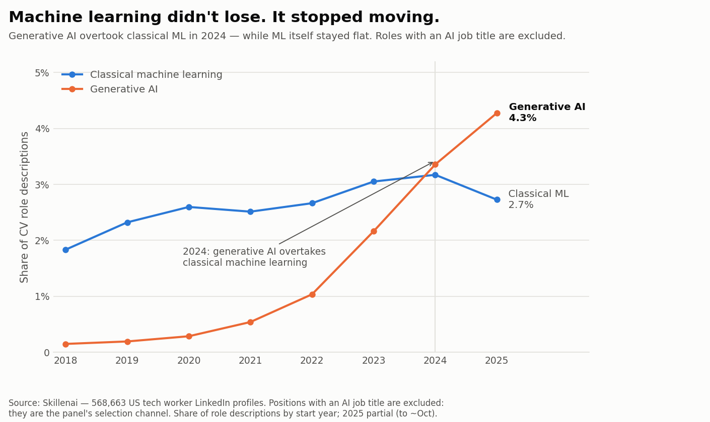
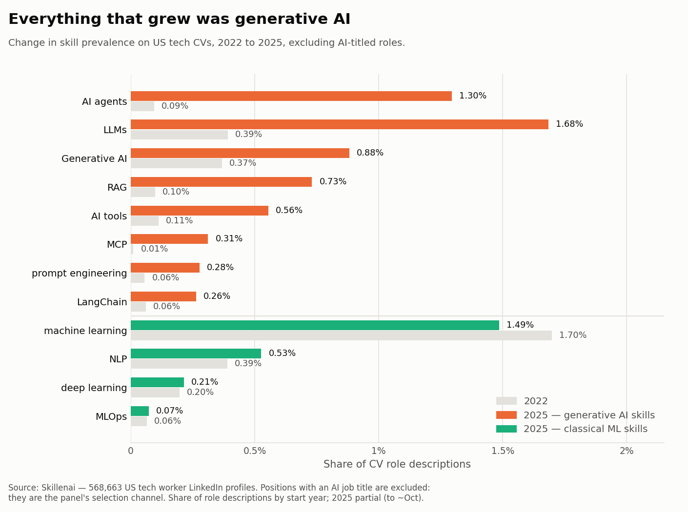
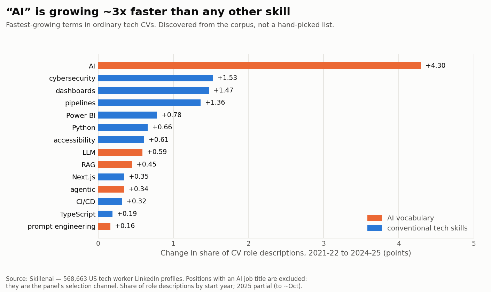
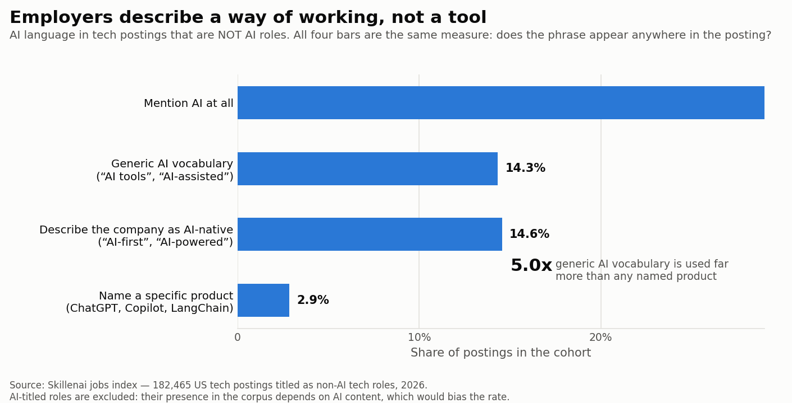
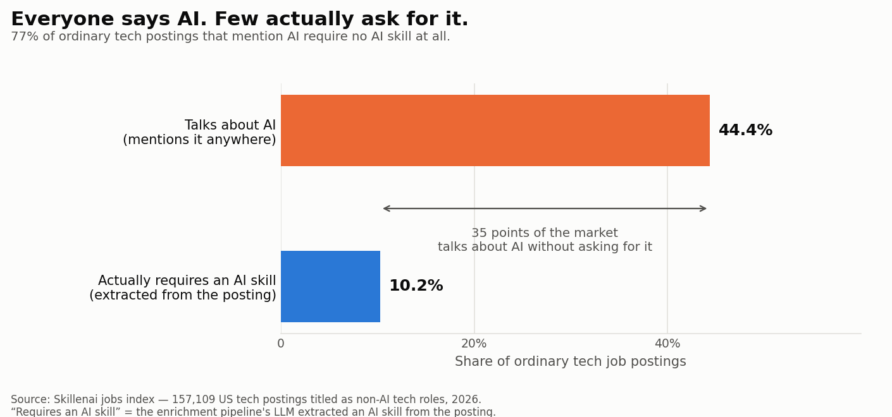

# AI skills on CVs: everyone says AI, few actually ask for it

**Date:** 2026-08-27
**Author:** Skillenai AI Analyst
**Sources:**
- **Supply** — Bright Data LinkedIn snapshots (`bd_20260724` + `bd_20260824`), deduped by `linkedin_id`: **568,663 unique US tech worker profiles**. Position descriptions dated by role start year. **Positions with an AI job title are excluded** — they are the panel's selection channel.
- **Demand** — Skillenai jobs index (`prod-enriched-jobs`), 2026-03-01 onward. Headline figures use a **182,347-posting cohort** titled as non-AI tech roles; the full 342,815-posting corpus selects on AI and is reported only as a contrast.

---

## TL;DR

Everyone asks whether AI skills are showing up on CVs. They are — but the interesting part is what happened to the skills they replaced.

**Generative-AI skills went from 1.0% of roles started in 2022 to 4.3% in 2025, and overtook classical machine learning in 2024.** Not because GenAI grew faster than ML. Because **ML stopped growing** — 2.66% in 2022, 2.73% in 2025 — and GenAI walked past a stationary target.

More bluntly: across 13,165 candidate terms, **"AI" is the second-fastest-growing phrase in ordinary tech CVs** (+4.30 points), beaten only by the word "ensuring". The best-performing conventional skill, cybersecurity, managed +1.53.

All supply-side figures **exclude positions with an AI job title**. Those roles are the panel's selection channel, and including them inflates the recent end of every trend — see the correction notes.

But on the demand side there is a gap between talk and ask. **44% of ordinary tech postings mention AI; only 10% actually require an AI skill.** 79% of the postings that mention AI ask for no AI skill at all.



The shift is real. It is a **substitution, not an expansion** — and on the demand side it is still a tiebreaker, not a filter.

---

## 1. The top 3 AI skills to emerge since 2022

Share of US tech CV position descriptions, by the year the role started.

Positions with an AI job title are excluded throughout.

| # | Skill | 2022 | 2023 | 2024 | 2025 | Change | Multiple |
|---|---|---:|---:|---:|---:|---:|---:|
| 1 | **LLMs** | 0.39% | — | — | **1.68%** | +1.29pp | 4.3x |
| 2 | **AI agents / agentic** | 0.09% | — | — | **1.30%** | +1.20pp | **13.7x** |
| 3 | **RAG** | 0.10% | — | — | **0.73%** | +0.63pp | 7.4x |
| 4 | Generative AI | 0.37% | — | — | 0.88% | +0.51pp | 2.4x |
| 5 | AI tools | 0.11% | — | — | 0.56% | +0.44pp | 4.9x |
| 6 | MCP | 0.01% | — | — | 0.31% | +0.30pp | **29.6x** |
| 7 | prompt engineering | 0.06% | — | — | 0.28% | +0.22pp | 4.9x |
| 8 | LangChain | 0.06% | — | — | 0.26% | +0.20pp | 4.3x |

**Positions 3 and 4 are inside the noise and should not be ranked confidently.** On the 300k half-corpus, Generative AI led RAG by +0.55 to +0.49; doubling the data flipped it to RAG +0.63, Generative AI +0.51. LLMs and AI agents at the top are stable across both.

**But none of these are what ordinary tech workers actually write.** All eight are dwarfed by bare "AI" at +4.30pp. RAG ranks 229th and agentic 327th out of 13,165 discovered terms; a product manager or frontend engineer writes "AI", not "RAG". The technique vocabulary belongs to AI roles — see §5.

**MCP is the fastest-growing skill in the corpus at 29.6x**, which fits — Model Context Protocol only launched in late 2024. We keep it out of the headline: n=29 in 2025, and bare "MCP" collides with the Microsoft Certified Professional credential. The 2025-only spike argues the signal is genuine (a stale certification would be flat or declining), but the base is too thin to quote.



## 2. The classical ML stack is flat — or shrinking

This is the finding that reframes the rest.

| Skill | 2022 | 2025 | Multiple |
|---|---:|---:|---:|
| machine learning | 1.70% | 1.49% | **0.9x** |
| NLP | 0.39% | 0.53% | 1.4x |
| deep learning | 0.20% | 0.21% | 1.1x |
| MLOps | 0.06% | 0.07% | 1.1x |

Once AI-titled roles are removed, "machine learning" does not merely flatten — it **declines**, from 1.70% to 1.49%. In ordinary tech roles the term is being used less than it was three years ago. The other classical families are flat. All net growth in AI skills on CVs since 2022 is GenAI-native.

## 3. GenAI overtook ML in 2024

| Year | Positions | GenAI (strict) | GenAI (loose) | Classical ML |
|---|---:|---:|---:|---:|
| 2020 | 47,641 | 0.29% | 0.49% | 2.60% |
| 2021 | 56,833 | 0.54% | 0.75% | 2.51% |
| 2022 | 57,011 | 1.04% | 1.33% | 2.66% |
| 2023 | 46,142 | 2.16% | 2.49% | 3.05% |
| 2024 | 40,432 | **3.36%** | 3.90% | **3.17%** |
| 2025 | 20,536 | 4.28% | 4.75% | 2.73% |

The crossover lands in 2024 under both the strict and loose definitions.

Note this table's "classical ML" is a broader regex than the family in §2 (it includes TensorFlow, PyTorch, scikit-learn, computer vision and NLP), which is why its levels are higher. The trend is the same: it peaks in 2023 and turns down.

## 3b. Is it overstated? Not against the rest of the stack

The skill vocabulary above was **discovered from the profile corpus**, not imported: we counted every 1-to-3-word phrase in non-AI tech CV descriptions, compared 2021–22 against 2024–25, and ranked by change. 13,165 phrases cleared the frequency threshold. Then we inspected the ranked list by hand and kept the ones that name a skill, discarding corporate filler (`ensuring`, `across`, `cross-functional`, `actionable`, `strategic`…).



| Term | 2021–22 | 2024–25 | Change | Rank of 13,165 |
|---|---:|---:|---:|---:|
| **ai** | 1.87% | 6.17% | **+4.30** | **2** |
| cybersecurity | 1.52% | 3.04% | +1.53 | 27 |
| dashboards | 4.12% | 5.59% | +1.47 | 30 |
| pipelines | 4.09% | 5.45% | +1.36 | 38 |
| power bi | 2.12% | 2.91% | +0.78 | 98 |
| python | 6.14% | 6.80% | +0.66 | 132 |
| llm | 0.15% | 0.74% | +0.59 | 157 |
| rag | 0.07% | 0.52% | +0.45 | 229 |
| agentic | 0.04% | 0.39% | +0.34 | 327 |
| ci/cd | 2.97% | 3.29% | +0.32 | 359 |
| typescript | 1.25% | 1.44% | +0.19 | 681 |

"AI" is the **second-fastest-growing phrase in the entire corpus**, beaten only by the word "ensuring". It grew **2.8x more than the best-performing conventional skill**. Against the normal churn of the tech stack, the AI shift is not overstated — it is not close.

But note *which* AI term is growing. Bare "ai" is at +4.30; `rag` and `agentic` rank 229th and 327th. **Ordinary tech workers claim AI generically, not by technique.** For a product manager or frontend engineer, "AI fluency" means using AI, not building with it.

## 4. Demand side: AI language in jobs that are *not* AI jobs

Measured on **182,470 postings whose title is a non-AI tech role** — software engineer, devops, security engineer, product manager and similar — with any AI-titled role excluded. This restriction is essential and explained under "the corpus selects on AI" below: the whole-corpus figure is inflated by construction.

**These four rows are all the same measure** — does the phrase appear anywhere in the posting? — so they can be compared with each other.

| Topic mention | Postings | Share |
|---|---:|---:|
| Mention AI at all | 84,575 | **46.4%** |
| Describe the company as AI-native ("AI-first", "AI-powered") | 26,564 | 14.6% |
| Generic AI vocabulary ("AI tools", "AI-assisted") | 26,142 | **14.3%** |
| Name a specific product (ChatGPT, Copilot, LangChain, …) | 5,219 | 2.9% |



**Nearly half of ordinary tech postings mention AI somewhere** — but see §5 for how little of that is a requirement. Generic vocabulary beats named products **5.0:1**: employers are describing a way of working, not a tool to tick off.

### Explicit requirement language — a floor, not a rate

**4.8%** of the cohort (8,683 postings) contains an explicit requirement construction aimed at the candidate — "experience with LLMs", "proficiency with AI", "hands-on experience with AI" and 18 similar phrasings.

**Treat that as a floor, not a measurement.** Requirements are also written as bullet points ("3+ years ML experience") and structured skill tags, which no phrase list catches. It is not comparable with the topic-mention rows above, and must not be used as the denominator of a ratio — see the correction notes.

## 5. The hype gap: talking about AI vs requiring it

This is the sharpest result in the analysis, and it uses **two independent instruments** on the same 182,470 postings rather than two phrase lists of our own construction:

- **Talk** — does the token "AI" appear anywhere in the posting? Catches marketing: *"Distyl is an applied AI technology company"*, *"AI-driven workflow automation"*.
- **Ask** — did the enrichment pipeline's LLM extract an AI skill as a requirement of the role? Catches requirements however they are worded, including bullet points and skill tags that phrase matching misses.



| | Postings | Share |
|---|---:|---:|
| Mentions AI anywhere in the text | 80,969 | **44.4%** |
| Actually requires an AI skill | 18,694 | **10.2%** |
| Talks about AI, requires no AI skill | 63,621 | **34.9%** |

(The talk row uses the bare token "AI"; §4's 46.4% uses a wider term set. Either way the story is the same.)

**Of the postings that mention AI, 79% ask for no AI skill at all.** The talk-to-ask ratio is **4.3 : 1**, and 35 points of the market — more than a third of all ordinary tech postings — discuss AI without wanting any from the candidate.

This is market positioning showing up in the hiring data. Claiming to be an AI company is close to free; requiring AI skills of your engineers is a real constraint on your hiring funnel. The 36-point gap is the size of the difference between the two.

**Why this measurement is trustworthy where the earlier one was not.** An earlier version of this analysis reported an "8:1" gap using two phrase lists we built ourselves at very different breadths; expanding the requirement list more than tripled it and the claim was withdrawn. Here the requirement side is not our vocabulary at all — it is a separate extraction system. A useful coherence check: the LLM extraction (10.2%) finds about 2.1x more than the 21-phrase floor in §4 (4.8%), which is exactly how a floor should behave relative to a real measure.

### Why there is no department breakdown

An earlier version reported that "AI language is densest outside engineering" — Marketing at 45.1% against Engineering's 34.1%. **That finding was withdrawn**; see the correction notes.

---

## Reproducing

```bash
source .env                       # SKILLENAI_INSIGHTS_API_KEY
python 01_discover_skill_vocab.py                       # -> skills_vocab.json
python 02_skill_families_by_year.py profiles.jsonl      # -> skill_families_by_year.csv
python 03_genai_vs_ml_trend.py     profiles.jsonl       # -> genai_vs_ml_by_year.csv
python 04_demand_side_postings.py                       # -> demand_side_stats.csv
python 06_ai_hype_gap.py                                # -> ai_hype_gap.csv
python 05_make_figures.py                               # -> 01..05 .png
```

The supply steps take two snapshot paths and dedupe by `linkedin_id`:

```bash
python 02_skill_families_by_year.py bd_20260824.jsonl profiles.jsonl
python 03_genai_vs_ml_trend.py     bd_20260824.jsonl profiles.jsonl
```

`ngram_growth.csv` (the discovered vocabulary, top 2,000 phrases by growth) is committed so the hand-inspection step is auditable — you can see every phrase that was considered, not just the ones kept.

`profiles.jsonl` is the Bright Data LinkedIn snapshot. **It is not in this repo and must not be** — it is personal data, held in `s3://skillenai-linkedin-pii-prod/raw/`. Only aggregates are committed here.

## Method notes

**The vocabulary is discovered, not hard-coded — and discovered from the right corpus.** An earlier version pulled the top 400 entity-resolved skills from the *jobs* index and measured those against CVs. That pre-committed the analysis to the skills AI roles ask for, which is why RAG and MCP topped the list: they were never going to be what a frontend engineer or product manager is asked to know.

The corrected method discovers the vocabulary from the population actually being asked about — every 1-to-3-word phrase in non-AI tech CV descriptions, ranked by change between 2021–22 and 2024–25 — and then uses the jobs corpus as a cross-reference rather than a source. `ngram_growth.csv` holds the full ranked list; the keep/discard classification was done by hand and is auditable against it.

**Entity fragmentation had to be merged.** Resolution splits one skill across several entities: `LLMs` / `LLM` / `Large language models (LLMs)` are three, and the agent family splits four ways (`AI agents` / `agentic AI` / `agentic workflows` / `Agents`). Measured unmerged, every one ranks below its true position. Bare `Agents` is excluded from the family — insurance and real-estate agents contaminate it.

**Ambiguous terms were audited, not assumed.** Pre-2020 positions are 56.4% of the corpus, so a term that is merely ordinary English should land ~56% of its hits pre-2020. Every suspect term came in far below that:

| Term | Hits | Pre-2020 share | vs 56.4% baseline |
|---|---:|---:|---|
| bare "RAG" | 857 | 5% | genuine |
| "prompting" | 103 | 11% | genuine |
| "embeddings" | 309 | 12% | genuine |
| "fine-tuning" | 1,069 | 20% | mostly genuine |

The headline trend still uses the **strict** pattern (ambiguous terms dropped) because it is what survives a challenge; the loose column is published alongside so the gap is visible rather than hidden.

**Never compare a topic-mention measure with a requirement-phrasing measure.** This one cost us a headline. An earlier draft of this analysis reported that employers describe themselves as AI-native **"8x more often than they ask candidates for AI proficiency" (16.1% vs 1.9%)**. That ratio was an artifact of the two phrase sets having very different breadth: the self-description set was four broad phrases matched anywhere in the text, while the requirement set was five narrow exact constructions.

Expanding the requirement set from 5 phrases to 21 obvious alternatives — `"experience with LLMs"`, `"experience using AI"`, `"hands-on experience with AI"` and similar — more than tripled it:

| Requirement phrase set | Postings | Share |
|---|---:|---:|
| Original 5 phrases | 6,688 | 1.95% |
| 16 phrasings that set missed | 16,237 | 4.74% |
| Union of all 21 | 22,065 | **6.44%** |

The original figure captured only **30%** of even this larger set, and 21 phrases is still not exhaustive. The 8.3:1 ratio becomes 2.5:1 at 6.4% — and since requirement detection remains incomplete while topic-mention detection is fairly complete, even 2.5:1 is an upper bound.

**The claim has been withdrawn.** Figure 3 now plots only topic-mention measures, the requirement rate is published as a floor, and `04_demand_side_postings.py` carries a measurement warning at the top of the file. The supply-side findings (the crossover, flat ML, the top-3 skills) come from a different dataset and method and are unaffected.

**The profile panel also selects on AI — exclude AI-titled positions.** Profiles are pulled with a job-title keyword list of ~80 R&D titles, and that list includes AI titles. A person enters the panel *because* they hold an AI-titled role — and AI titles are overwhelmingly recent, while their earlier positions carry ordinary titles. The bias therefore lands specifically on the recent end of any trend, which is the exact shape of the headline finding.

It is measurable. AI-titled positions grow as a share of dated positions:

| Year | Positions | AI-titled | Share |
|---|---:|---:|---:|
| 2018 | 27,657 | 620 | 2.2% |
| 2020 | 25,962 | 975 | 3.8% |
| 2022 | 31,422 | 1,476 | 4.7% |
| 2024 | 23,155 | 1,957 | 8.5% |
| 2025 | 11,849 | 1,315 | **11.1%** |

The selection channel itself grows 5x across the window. Excluding those positions:

| Measure | All positions | AI-titled excluded |
|---|---:|---:|
| GenAI 2022 | 1.59% | 1.06% |
| GenAI 2025 | 7.64% | **4.28%** |
| Growth | 4.8x | **4.0x** |
| Classical ML 2022 → 2025 | 4.60% → 5.06% | 2.72% → 2.60% |
| Crossover year | 2024 | **2024** |

The uncorrected recent end was **~1.8x overstated**. Every headline survives the correction — 4.0x growth, flat ML, crossover still 2024 — but the levels are materially lower, and the corrected top-3 ordering changes: RAG drops from third to fourth and Generative AI takes its place.

**The corpus selects on AI, so the demand-side denominator must be chosen with care too.** Inclusion is decided by keyword in [`lambdas/jobs_scraper/normalize.py`](https://github.com/skillenai/skillenai-ds) (`is_rnd_relevant`). A posting is admitted if **either** its title matches an R&D title keyword — a list that includes `"ai"`, `"llm"`, `"generative"`, `"machine learning"` — **or** its description names ≥3 `RND_SKILLS`, of which roughly 35 are AI-specific (`llm`, `rag`, `langchain`, `pytorch`, `embeddings`, `fine-tuning`…).

A posting naming LLM + RAG + LangChain and nothing else is therefore admitted purely on AI content. Measuring "what share of the corpus mentions AI" conditions on the numerator — and indeed **23.5% of the corpus is AI-titled**, guaranteed to mention AI.

**The fix** is to restrict to postings admitted via a *non-AI* title keyword, with no AI term in the title at all. Those were admitted regardless of AI content, so within that cohort the rate is unbiased with respect to this selection:

| Denominator | Postings | Mention AI |
|---|---:|---:|
| Whole corpus (contaminated) | 342,815 | **55.4%** |
| Non-AI-titled cohort (used here) | 182,470 | **46.4%** |

The whole-corpus headline was **1.2x overstated**. The cohort figure is also the more interesting one — it is AI language appearing in ordinary engineering jobs rather than in jobs already about AI. Note the generic-versus-named-product ratio moves the *other* way once AI roles are removed, from 3.8:1 to 5.0:1: AI-titled postings are the ones naming specific products.

**Never break this corpus down by department — the same problem, worse.** The jobs index deliberately targets tech and AI roles and excludes everything else. A non-tech department therefore appears in the corpus *only* when a posting matched tech/AI criteria in the first place. Measuring the AI-mention rate of those survivors conditions on the outcome.

A sample of postings tagged `department=Marketing` shows the problem directly:

```
Senior Generative AI Designer / Artist
Marketing Data & Agentic AI Transformation Lead
Junior Marketing Specialist – Content, Growth & AI
CMO/VP Marketing (Retail Vertical AI Company)
Forward Deployed AI Accelerator, Marketing
Marketing AI - Content Manager
```

Several carry AI in the job title. These are not representative marketing postings; they are the marketing postings that look like tech postings. The withdrawn claim (Marketing 45.1% vs Engineering 34.1%) measured the filter, not the labour market. The department queries have been removed from `04_demand_side_postings.py` with a comment explaining why, so the finding cannot be casually reintroduced.

The same caution applies to any future cut of this corpus by industry, function or seniority where the filter might correlate with the thing being measured.

**Named-entity collisions removed.** `Claude` (a common French given name), `Cursor` (UI and database cursors) and `Gemini` (zodiac sign, unrelated product lines) all scored highly on the demand side and were discarded as entity-name collisions rather than AI mentions.

## Caveats

- **US tech only**, both sides. Not a claim about the labour market as a whole.
- **String matching, not the enrichment pipeline's extracted skills.** `HAS_SKILL` edges in the talent graph attach to the person and carry **no dates** — 0 of 18,412 sampled edges had a `startDate` — so they cannot answer "when did this skill appear". Tracked as **SKI-577**. Until that lands, a dated supply-side series can only come from raw position descriptions.
- **Self-reported.** CV text is what people claim, not what they can do.
- **~35% of positions carry a description**; the rest contribute nothing to the supply-side measure.
- **2025 is partial.** The Bright Data `experience` field is vendor-current only to ~Oct 2025 (a known vendor issue, not a pipeline bug), so 2025 has 11,849 positions against 23,155 in 2024. Shares are still comparable; counts are not.
- **Retroactive CV editing biases against the trend.** People add AI to descriptions of older roles, inflating early years and flattening the curve. The real growth is likely steeper than reported.
- **No YoY on the demand side.** The jobs index begins 2026-03-10; every posting figure is a within-window share.
- Small-n departments (Customer Success n=562, Finance n=1,115) are indicative only.
