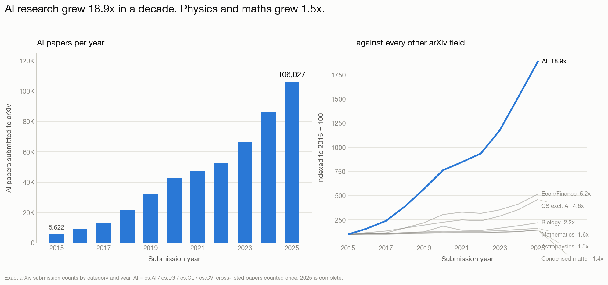
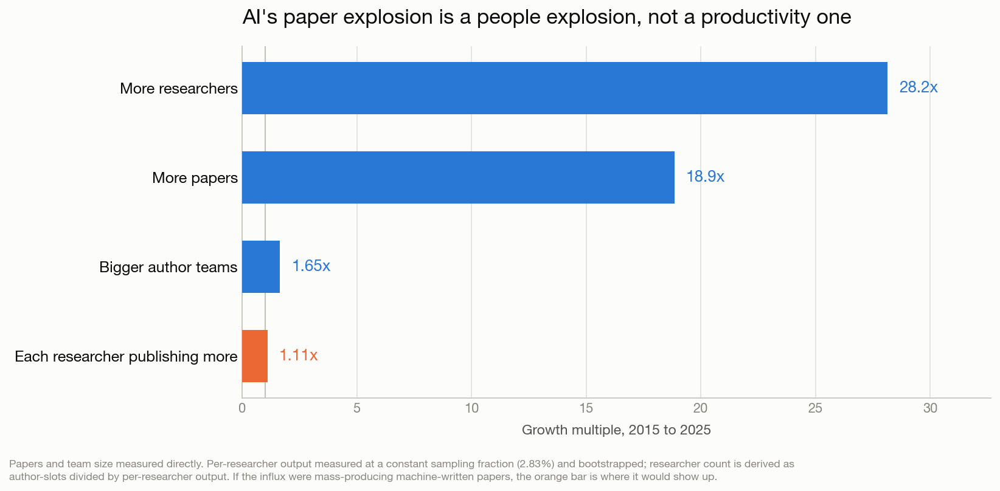
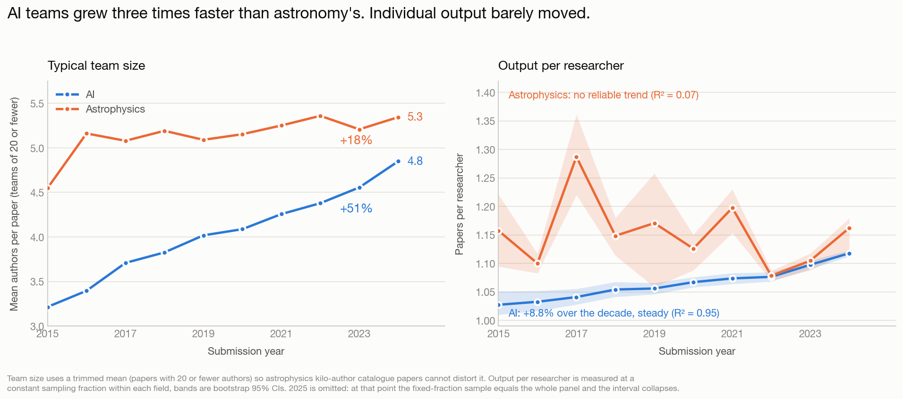
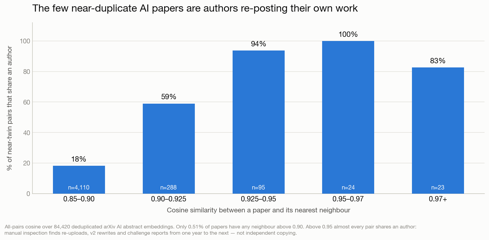

# The AI paper flood is 28× more people — not 28× more slop

**Date:** 2026-09-05
**Author:** Skillenai AI Analyst
**Sources:** arXiv API (exact submission counts and cohort samples, 2015–2025); Skillenai scholarly index (`prod-enriched-scholarly`, 84,428 arXiv AI papers with abstract embeddings, 2026-03-09 → 2026-09-04)

---

## TL;DR

A widely-shared complaint about AI conferences holds that the field is drowning in machine-generated papers reviewed by machine-generated reviews. The volume half of that is easy to confirm: arXiv AI submissions grew **18.9× in a decade**, from 5,622 in 2015 to 106,027 in 2025, while astrophysics grew 1.5× and mathematics 1.6× on the same platform.

The composition half does not hold up.

- **The growth is people, not productivity.** Author-slots grew 31×, but output per researcher rose only **8.8%** over the decade. The implied researcher headcount grew roughly **28×**.
- **AI teams grew three times faster than astronomy's** — +51% vs +18% authors per paper.
- **The papers are not copies.** Across 84,420 deduplicated abstracts, only **0.51%** have a near-twin, and among the tightest matches **93–100% share an author** — researchers re-posting their own work.

> **The AI paper flood isn't 28× more slop. It's 28× more people — each publishing 9% more than a decade ago.**

Two things this analysis explicitly does **not** show, discussed in full below: it cannot detect machine-written text (the published literature can, and puts it at 17–22% of computer-science preprints), and it cannot measure peer-review rates from arXiv metadata (we tried; the metadata does not support it, and Section 5 documents why).

---

## 1. The flood is real, and it is specific to AI



Exact arXiv submission counts, by category, per year. AI here is the union of `cs.AI`, `cs.LG`, `cs.CL` and `cs.CV`, with cross-listed papers counted once.

| Field | 2015 | 2025 | Growth |
|---|---:|---:|---:|
| **AI** (cs.AI/LG/CL/CV) | 5,622 | 106,027 | **18.9×** |
| Econ / Finance | 875 | 4,519 | 5.2× |
| Computer science excluding AI | 2,225 | 10,258 | 4.6× |
| Biology (q-bio) | 2,300 | 5,068 | 2.2× |
| Mathematics | 32,291 | 52,419 | 1.6× |
| Astrophysics | 14,938 | 21,870 | 1.5× |
| Condensed matter | 16,763 | 24,115 | 1.4× |

This rules out the simplest objection — that arXiv as a whole got busier. Mature fields grew 1.4–1.6× over the same decade on the same platform. AI grew roughly **thirteen times faster** than they did, and four times faster than the rest of computer science.

---

## 2. The growth is people, not productivity

If large language models had turned researchers into paper machines, the effect would appear as a jump in output per researcher. It does not.



Paper output decomposes multiplicatively:

```
papers  =  researchers  ×  papers per researcher  ÷  authors per paper
```

| Component | 2015 → 2025 |
|---|---:|
| More researchers (derived) | **~28×** |
| More papers | 18.9× |
| Bigger author teams | 1.65× |
| **Each researcher publishing more** | **1.11×** |

In log terms, headcount accounts for roughly **97%** of the growth impulse and per-researcher output for about **3%**.

Measured against 2024 rather than 2025 — which avoids a degenerate endpoint explained in the methodology — per-researcher output rose **+8.8%** across the decade. The trend is real and remarkably steady (linear fit R² = 0.95, t = 12.9), but the magnitude is what matters: a **9% lift per person against a 28-fold increase in people**.

---

## 3. Astronomy as a control: teams grew, individuals didn't

Astrophysics is a useful counterfactual — a mature field on the same platform, with the same publish-or-perish pressures and the same access to the same writing tools, but no comparable influx.



| | Papers | Team size | Output per researcher |
|---|---:|---:|---:|
| **AI** | 18.9× | 3.21 → 4.85 (**+51%**) | +8.8% (steady, R² = 0.95) |
| **Astrophysics** | 1.5× | 4.55 → 5.34 (+18%) | no reliable trend (R² = 0.07) |

Two things stand out.

**Team inflation is AI-specific.** AI's typical paper went from three authors to nearly five, a 51% increase, against 18% in astronomy. This is consistent with — though it does not prove — more junior contributors being added to author lists as the field's population expanded.

**The productivity story is small in both fields.** AI's +8.8% is a genuine trend; astronomy's series oscillates with no reliable direction. Neither field shows anything resembling a productivity revolution. Whatever AI writing tools are doing to scholarly output, it is not visible as a step change in papers per person.

Team size here uses a **trimmed mean over papers with 20 or fewer authors**. Astrophysics runs kilo-author collaborations — LIGO, DESI, survey catalogues — whose author lists reach into the hundreds, dragging the untrimmed mean above 12 and making a naive comparison meaningless.

---

## 4. The papers are not copies

Every document in the Skillenai scholarly index carries a 256-dimension, L2-normalised abstract embedding, so cosine similarity is a dot product and an exact all-pairs comparison across the corpus is tractable. We ran it over **84,420 papers** after removing duplicate `arxivId` and `contentHash` records — an essential step, since double-ingested papers would otherwise manufacture the very duplicates being measured.



**Only 0.51% of papers have any neighbour above cosine 0.90.** At 0.95 it is 0.06%; at 0.99, four papers in the entire corpus.

And the duplicates that exist are overwhelmingly self-authored:

| Cosine band | Pairs | Share an author |
|---|---:|---:|
| 0.850–0.900 | 4,110 | 18.3% |
| 0.900–0.925 | 288 | 59.0% |
| 0.925–0.950 | 95 | **93.7%** |
| 0.950–0.970 | 24 | **100%** |
| 0.970+ | 23 | 82.6% |

We calibrated the thresholds by reading pairs at each level rather than assuming a cutoff. Above 0.95 the matches are re-uploads under a new identifier, versioned rewrites (a speech-codec paper appearing at "200bps" and "300bps" with the same seven authors), and annual challenge reports. The band where genuinely independent teams converge is 0.90–0.925, where author overlap drops to 59% — and it contains 288 pairs out of 84,420 papers.

**What this does and does not show.** It refutes the specific claim that arXiv is filling with the same paper written repeatedly. It says nothing about quality. A field could produce a hundred thousand entirely distinct and entirely forgettable papers and score exactly the same on this measure. Redundancy is not the same as merit, and the marginal-paper critique is untouched by this result.

---

## 5. Two things this data cannot tell you

### It cannot detect machine-written text

Embedding similarity measures redundancy, not authorship. A fully machine-drafted paper that is semantically distinct is indistinguishable here from a human-written one.

The published literature *can* measure this, and does: analyses of over a million preprints estimate that up to **22% of computer-science papers** contain LLM-modified text, with a separate 2024 study putting it at 17.5%. Machine-assisted writing is genuinely present in this corpus. Our finding is narrower — that it is not what is driving the *volume*, because volume tracks headcount and per-person output barely moved.

### It cannot measure peer-review rates

We attempted to measure what fraction of AI preprints ever record a peer-reviewed venue, using the arXiv `journal_ref`, `doi`, and free-text `comment` fields. **The measurement does not survive scrutiny, and we are reporting the negative result because it is a trap worth flagging.**

Two independent failures:

**The detection path differs by field.** Astrophysics publishes in journals, which register DOIs; AI publishes at conferences, which frequently register neither. Only **18.3%** of AI papers carry a structured record against **77.3%** of astrophysics papers. Testing our free-text parser against papers we know were accepted (because they carry a `journal_ref`), it recovers just **32.5%** of AI acceptances versus 60.0% in astrophysics. Correcting AI for its own measured recall moves the estimate by more than the cross-field gap being measured.

**The detection path drifts over time.** The share of papers carrying a structured record fell from 80.5% to 47.4% in astrophysics between 2015 and 2024, and from 22.8% to 14.1% in AI. Any apparent decline in "peer-reviewed share" is substantially a decline in *metadata registration*, not in peer review.

A related confound defeats the obvious workaround. Restricting to papers whose venue appears in version 1 removes censoring, but that measure captures a *publishing norm* — posting to arXiv only once accepted — rather than an acceptance rate, and that norm has been shifting.

Anyone attempting to quantify peer-review rates from arXiv metadata should expect to measure metadata practice instead.

---

## 6. You cannot rank prolific AI authors from arXiv metadata

The obvious way to find hyper-prolific researchers — count papers per author name — produces a list that is entirely artefact.

| Author name | Raw papers (180 days) | Implied pace |
|---|---:|---|
| Yang Liu | 269 | one every 0.7 days |
| Hao Wang | 205 | one every 0.9 days |
| Wei Wang | 176 | one every 1.0 days |

These are not individuals. "Yang Liu" is one of the most common name combinations on earth, and the entire top-40 consists of short, high-frequency names — exactly what name-collision base rates predict and nothing like what individual productivity would produce.

Splitting each name by **co-author-set fingerprinting** — two papers belong to the same person if they share at least two other co-authors, then taking the transitive closure — resolves "Yang Liu" into **157 distinct collaboration clusters**, the largest containing 23 papers.

The method is sensitive to how much collaboration evidence you demand. Requiring a single shared co-author merges the blob into 64 clusters with a largest component of 190, because prolific collaborators bridge unrelated researchers. We report the stricter rule and note the range rather than presenting one number as settled.

After disambiguation the most prolific single individuals publish **30–55 papers in six months** — remarkable, entirely plausible for a senior investigator leading a large group, and an order of magnitude below the raw counts.

There is no author-affiliation data available to do this properly. The dedicated arXiv affiliation field is populated on **0.4%** of author slots, and while affiliations appear inline in author strings on about 1.2% of papers, that is far too sparse to disambiguate at scale.

---

## Methodology

**Data sources.** Exact annual submission counts come from the arXiv API's `opensearch:totalResults` for each category and year. Cohort samples for team size and per-researcher output are month-stratified: 250 papers per month per year for AI (3,000/year), and quarterly sampling for astrophysics (800/year). Embeddings and the corpus for the duplication analysis come from the Skillenai scholarly index.

**Per-researcher output.** Distinct-author counts cannot be extrapolated from a sample, so output per researcher is measured at a **constant sampling fraction** within each field — 2.83% for AI, 4.03% for astrophysics — and bootstrapped over 400 draws. The absolute level is biased low, but the bias is identical across years, so the trend is interpretable. An earlier version of this analysis held the sample *size* constant instead, which is wrong: papers-per-author within a sample depends on the sampling fraction, not the sample size, and with a fixed sample the fraction fell 53% → 2.8% as the corpus grew, manufacturing an apparent decline. The corrected design reverses the sign.

**2025 endpoint.** The 2025 cohort is excluded from trend fits because at a constant sampling fraction its sample equals the entire available panel, collapsing the bootstrap interval to a point.

**Team size.** Trimmed mean over papers with 20 or fewer authors, to prevent astrophysics mega-collaborations from dominating the comparison.

**Duplication.** Exact all-pairs cosine over 84,420 papers after deduplication by `arxivId` and `contentHash`, computed in chunked blocks. Thresholds were calibrated by manual inspection of sampled pairs in each band rather than assumed. A within-month analysis at fixed subsample size (N = 6,000) shows no upward trend in redundancy across the six-month window, but six months is too short to make a claim about trend.

**Author name handling.** Author strings containing unbalanced parentheses or fewer than two tokens are discarded as parsing artefacts. The upstream ingestion splits author strings on commas without respecting parentheses, so an author listed as `Name (University, Country)` becomes two entries — one of which is the country. This produced `China)` as the single most frequent "author" in the corpus, ahead of every real researcher, and it is filtered before any author analysis.

**Known limitations.** Big-name collision effects make the derived headcount figure conservative — collisions merge distinct people, so the true researcher growth is likely higher than 28×. The redundancy analysis covers abstracts only, within a six-month window, so a paper duplicating older work outside that window is invisible to it. Peer-review rates are not measurable from this data, as documented in Section 5.

---

## Files

| File | Contents |
|---|---|
| `volume_by_field.csv` | Annual arXiv submission counts, seven field groups, 2015–2025 |
| `growth_decomposition.csv` | Team size and per-researcher output by year and field, with bootstrap CIs |
| `duplicate_bands.csv` | Near-duplicate pair counts and author-overlap share by cosine band |
| `author_disambiguation.csv` | Top 40 author names by raw count, with cluster counts after fingerprinting |

Raw per-paper embeddings (84,428 records) and cohort crawl output are not committed for size reasons; available on request.
