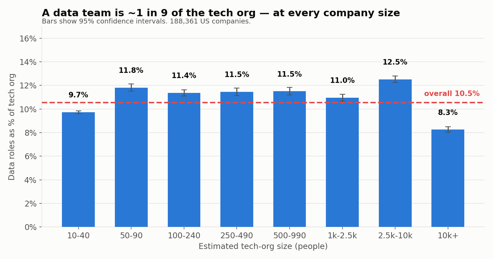
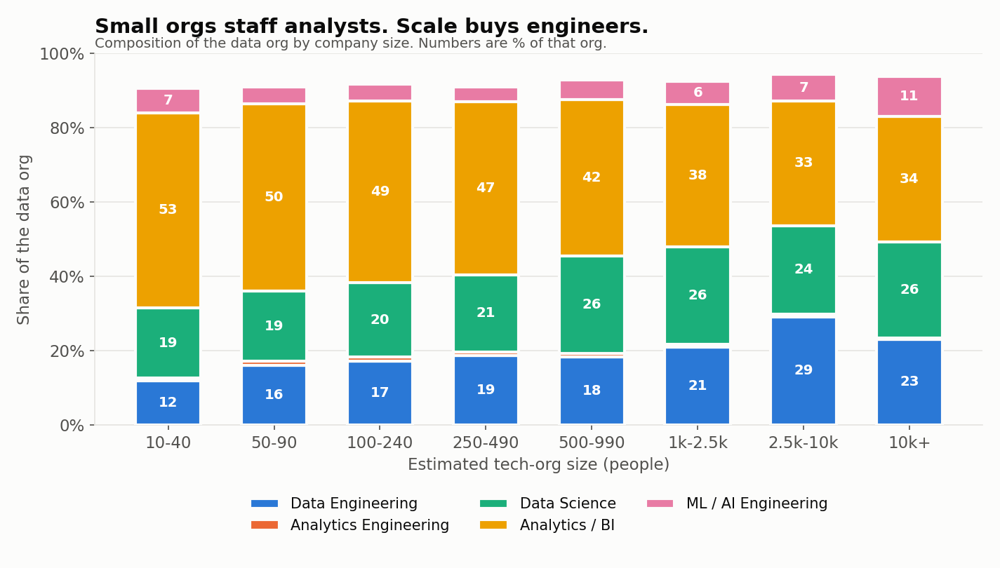
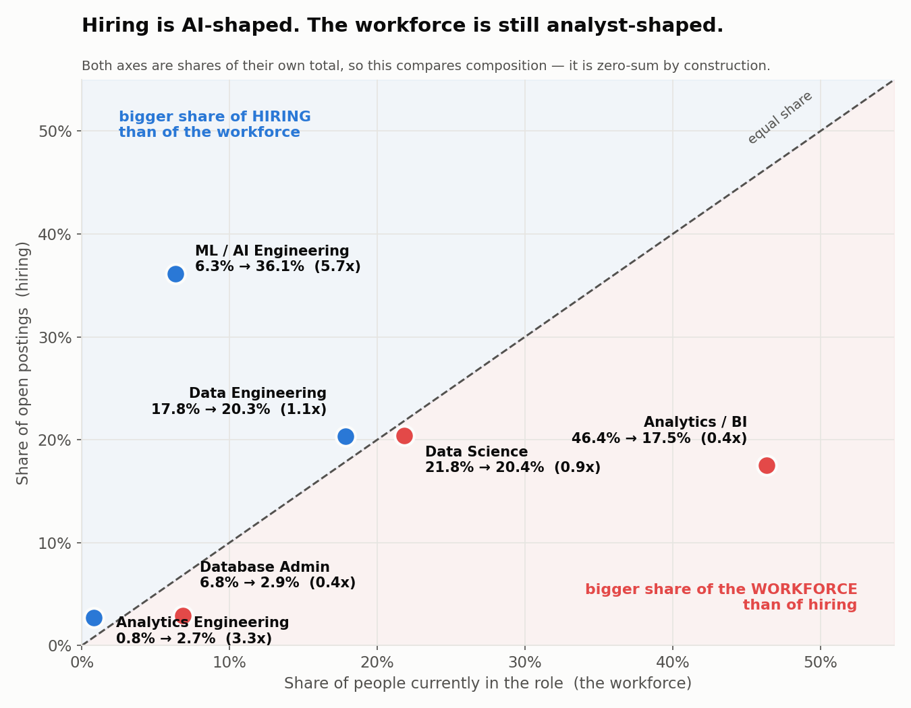

# How Big Should a Data Team Be?

**547,000 US tech profiles and 182,000 open job postings say the answer is a ratio, not a number.**

*Analysis date: 2026-09-08 · Source: Skillenai talent graph (supply) + Skillenai jobs index (demand)*

---

## The question

"How many people should be on our data team?" is usually answered with anecdotes — someone
says *we're 6 engineers at a 1,600-person company*, someone else says *we're 40 analytics
engineers at 8,000*, and nobody can tell whether either is normal.

The obvious framing — data headcount as a share of *total company employees* — turns out to be
close to useless. It mostly measures what industry you're in. A 3,000-person health insurer and
a 3,000-person SaaS company have wildly different fractions of their staff in any technical
role at all, so the comparison never lands.

Measured against the **tech org** instead — the people in software, product, data, AI and design —
the picture gets sharp immediately.

## Finding 1: a data team is ~1 in 9 of the tech org, at every size

Across 188,361 US companies, data roles are **10.5%** of the tech org. Broken into eight size
bands spanning roughly 10-person tech teams to 10,000+, every band lands between **9.7% and
12.5%**.

| Est. tech org | Companies | Data share | 95% CI |
|---|---:|---:|---|
| 10–40 | 176,036 | 9.7% | 9.6–9.9% |
| 50–90 | 6,583 | 11.8% | 11.5–12.1% |
| 100–240 | 3,613 | 11.4% | 11.1–11.6% |
| 250–490 | 1,130 | 11.5% | 11.1–11.8% |
| 500–990 | 539 | 11.5% | 11.2–11.8% |
| 1k–2.5k | 308 | 11.0% | 10.7–11.2% |
| 2.5k–10k | 126 | 12.5% | 12.2–12.8% |
| 10k+ | 26 | 8.3% | 8.0–8.5% |

A 100-fold change in company size moves the ratio by a couple of points. If you want a single
number to benchmark against, **one data person per nine in the tech org** is it.

The two ends dip slightly for opposite reasons. The smallest band is dominated by companies with
one or two technical people, where a dedicated data hire hasn't happened yet. The 10k+ band is a
handful of very large employers whose tech orgs contain enormous platform and infrastructure
populations that dilute the data function.

## Finding 2: the size is fixed, the shape is not

This is where the interesting variation lives. As the tech org grows from a handful of technical
staff to 10,000+:

- **Data Engineering more than doubles** — 11.9% → 29.1% of the data org
- **Analytics / BI falls by a third** — 52.5% → 33.5%
- **Data Science climbs** — 19.0% → 25.7%
- **ML / AI Engineering more than doubles** — 4.6% → 10.8%

At small scale, a data team is mostly people who *answer questions*. At large scale, it is
increasingly people who *build the systems that answer questions*. The crossover is gradual and
monotonic rather than a step change — there's no single headcount where a company suddenly
"needs data engineers."

The practical reading: if you are a 200-person tech org with a data team that is 50% analysts,
you look exactly like your peers. If you are a 3,000-person tech org with the same shape, you
are carrying an analyst-heavy org into a scale where most companies have converted to
engineering, and the queue of ad-hoc requests is probably telling you so.

## Finding 3: hiring is AI-shaped, the workforce is still analyst-shaped

Put the **workforce** (what people currently do) against **open postings** (what employers are
trying to hire) and every role lands on the same axes.

| Role | Share of people | Share of postings | Hiring / workforce |
|---|---:|---:|---:|
| ML / AI Engineering | 6.3% | 36.1% | **5.7x** |
| Analytics Engineering | 0.8% | 2.7% | **3.3x** |
| Data Engineering | 17.8% | 20.3% | 1.1x |
| Data Science | 21.8% | 20.4% | 0.9x |
| Database Admin | 6.8% | 2.9% | 0.4x |
| Analytics / BI | 46.4% | 17.5% | **0.4x** |

**Read this as a comparison of two mixes, not as a supply shortage.** Both columns are shares of
their own total, so the diagonal is zero-sum by construction — if one role is over-represented in
hiring, another must be under-represented. The finding is that the *shape* of what employers are
buying differs sharply from the shape of who is available.

Two roles are hired well above their share of the workforce. **ML / AI Engineering** is the
extreme: 6.3% of people in data roles, **36.1% of open data postings**. **Analytics Engineering**
is second at 3.3x, and is by far the smallest of the six in absolute terms — fewer than 1 in 100
people in a data role hold the title.

**Data Engineering and Data Science are close to parity** (1.1x and 0.9x). These are the roles
where the workforce and the hiring market are roughly the same shape.

The two on the other side are **Analytics / BI** and **Database Admin**, both at 0.4x. BI is the
one that matters, because of its size: **it is 46% of the data workforce and 18% of the hiring.**

That single row is the counterweight to everything above it. Nearly half the people in data roles
today sit in the category employers are hiring into least, relative to its size. This is the same
pattern Finding 2 shows across company size — BI-heavy at small scale, engineer-heavy at large —
except here it appears as a *time* signal rather than a size one. **The market is hiring toward
the shape that large organizations already have.**

It does not mean analyst roles are disappearing. 17.5% of a large hiring market is a great many
jobs, and the BI function is not going anywhere. But anyone reading this as a career signal
should note that the two fastest-growing categories relative to their size are the two that sit
between analysis and engineering.

## What this does not show

- **These are ratios, not headcounts.** Our sample only sees people whose LinkedIn *headline*
  contains a recognizable job title. Plenty of people write a tagline instead. That recall gap
  is roughly uniform across roles, so proportions hold up, but any absolute headcount derived
  from this data is a floor rather than an estimate.
- **Title ≠ job.** Someone titled "Data Analyst" may be doing analytics engineering work, and
  vice versa. The gaps in Finding 3 partly reflect titles catching up to work that is already
  happening — especially for ML/AI, where the label moved faster than most people's profiles.
- **Finding 3 compares two mixes, not two levels.** Both axes are shares of their own total, so
  the comparison is zero-sum: a role above the diagonal mathematically requires another below it.
  It says the hiring mix differs from the workforce mix. It does *not* say there is an absolute
  shortage of any role, and the ratios would change if the set of roles compared changed.
- **A stock is being compared to a flow.** The workforce is everyone currently in a role; postings
  are openings advertised in a window. Roles with higher turnover or faster growth generate more
  postings per person employed, which inflates their ratio independently of headcount growth.
- **No causality about team effectiveness.** Nothing here says a 1-in-9 team is the *right*
  size, only that it is the normal one. A deliberately lean team and an under-resourced one look
  identical in this data.
- **Company size is estimated from the tech org**, not from a headcount register. Bands are
  labelled with approximate real-world tech-org sizes.

## Methodology

**Supply side.** 568,663 unique US profiles from a licensed LinkedIn dataset, assembled from two
monthly snapshots (each an independent random sample of a ~2.9M US population filtered to
software, product, data, AI and design job titles), deduplicated on profile ID. 546,984 (96%)
carry a current employer and a usable current title.

Each profile contributes exactly one row: its **current employer** plus the best available
current title. Title is taken from the matching `experience` entry where one exists (66% of
rows) and parsed from the profile headline otherwise (34%). An early version of this pipeline
selected only roles explicitly marked `Present`, which silently dropped 47% of profiles whose
current role has null dates — those profiles are recovered by anchoring on the current-employer
field instead.

**Demand side.** 181,955 US job postings from the Skillenai jobs index, aggregated by normalized
role, with known carpet-bombing employers excluded. The *same classifier* is applied to both
supply and demand so the two sides are directly comparable.

**Role classification.** Titles are bucketed by an ordered rule set (most specific first) into
Data Engineering, Analytics Engineering, Data Science, Analytics / BI, ML / AI Engineering,
Database Admin and Data Leadership. Findings 1 and 2 use all seven. Finding 3 uses the six
practitioner buckets, excluding Data Leadership — it is a management layer rather than a role
people are hired into as practitioners, and posting volumes for it are not comparable. Deliberately excluded: QA/test analysts, security analysts,
programmer-analysts, financial/clinical/supply-chain analysts, data-entry and data-governance
roles, students, interns, and degree strings ("MS in Data Science").

**Business Analysts are excluded**, and this is the single most consequential judgment call
here. There are 13,398 of them — the largest single title in the corpus. They are predominantly
IT requirements-gathering roles rather than DE/AE/DS/BI practitioners, and companies that employ
both treat them as different jobs. Including them would move the headline from **10.5% to
15.8%**.

**External validation.** The corpus reproduces BLS Occupational Employment Statistics (2025)
ratios reasonably well: Data Scientists to Database Administrators is **3.19** here versus
**3.75** at BLS. Coverage relative to BLS occupational totals is ~5–7%, which is *not* the
sampling rate — BLS counts everyone in an occupation, while this corpus only admits people whose
headline matches a technical title.

**Statistics.** Proportions carry 95% Wilson score intervals. Size-band results are pooled
across companies rather than averaged per company, because per-company counts at this sampling
density are dominated by Poisson noise — an individual mid-size company's data team cannot be
measured this way, only a population of them.

## Files

| File | Contents |
|---|---|
| `build.py` | Regenerates every figure and table |
| `classify.py` | The title → role-bucket classifier |
| `size_band_table.csv` | Data share and role mix per size band |
| `supply_vs_demand.csv` | Supply/demand shares and ratios per role |
| `national_role_mix.csv` | Overall role composition |

### Reproducing

`build.py` reads two inputs that are **not committed**: a per-profile extract (personal data)
and a cached role-count response from the jobs index. Point at them with `ROLES_TSV` and
`DEMAND_JSON`. The profile extract holds one row per profile — profile ID, company ID, company
name, title, title source, country, city.
