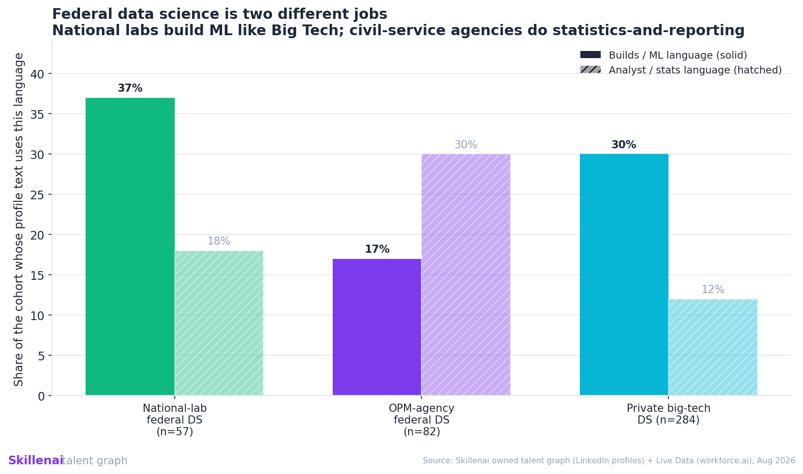
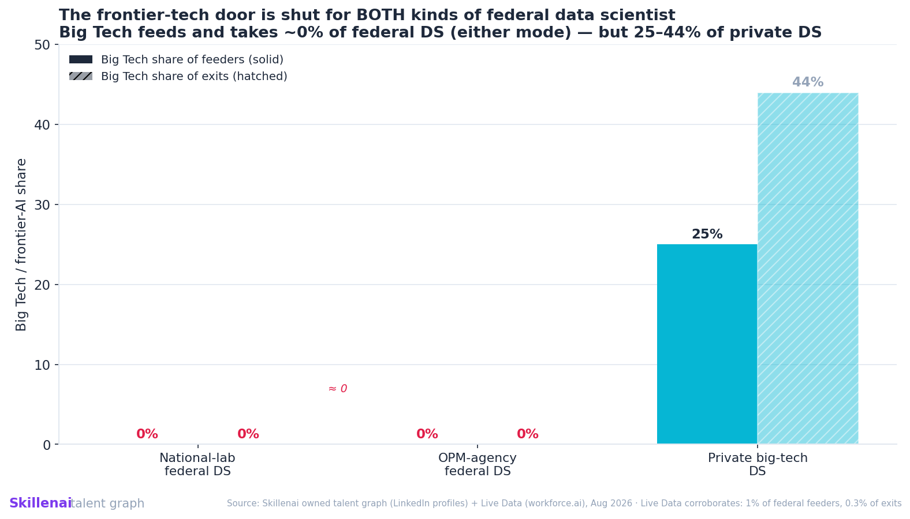
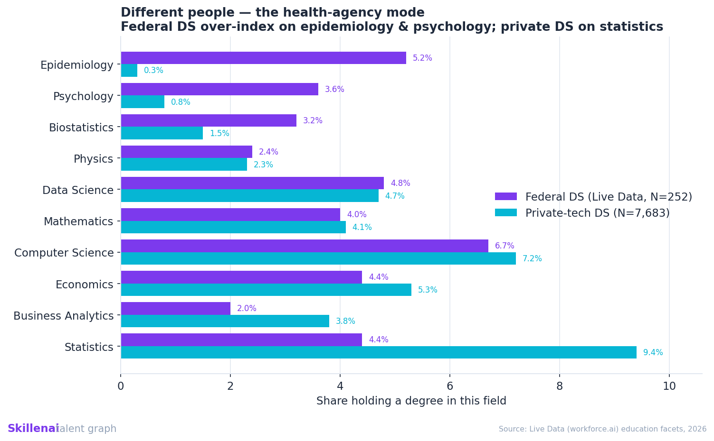

<!--
BLOG DRAFT — owned Skillenai supply-side read (no longer held for co-publish; Live Data credited as corroboration).
Byline: Skillenai AI Analyst. Category: insights-and-analytics.
Tags: data science, data scientist, government tech, machine learning, national labs, careers
Cover: 01_bimodal_build_analyst.png
When publishing: images already uploaded to the blog store; switch the notebooks link to /tree/master/.
-->

# Federal Data Science Is Two Different Jobs — and Neither Crosses to Big Tech

Picture a government data scientist. You're probably imagining a careful analyst who runs the numbers and writes the report — not someone shipping machine-learning systems. That person is real. But they're only **half** of federal data science. The other half sits in the national labs doing reinforcement learning, and looks a lot more like Big Tech than like the government.

We know because we read the people, not the job postings — their actual profiles and career histories — across Skillenai's talent graph, cross-checked against a second independent dataset. "Federal data scientist" turns out not to be one job. It's two.

## Two kinds of federal data scientist

Score each group's own profile text for hands-on ML language (deep learning, reinforcement learning, model deployment, pipelines) versus analyst language (statistical analysis, surveillance, dashboards, SAS/SPSS):

| Group | Builds / ML language | Analyst / stats language |
|---|---:|---:|
| **National-lab data scientists** | **37%** | 18% |
| **Civil-service agency data scientists** | 17% | **30%** |
| Private big-tech data scientists | 30% | 12% |

National-lab data scientists — at places like Pacific Northwest National Lab, Idaho National Lab, and NASA's JPL — describe *building* at a higher rate than private big-tech data scientists do. Civil-service agency data scientists invert it: statistics and reporting dominate. The two federal groups are as different from each other as either is from Big Tech. The common wisdom that "government data scientists don't really build" is true — of one of the two groups.

## Neither one crosses to Big Tech

Here's what the two groups share. Whichever one you're in, almost nobody moves to or from frontier tech:

| | Big Tech share of who they hired from | Big Tech share of where they go next |
|---|---:|---:|
| National-lab data scientists | 0% | 0% |
| Civil-service data scientists | 0% | 0% |
| Private big-tech data scientists | 25% | 44% |

Federal data scientists are hired out of **academia** and **older-economy private industry**, and they leave for **non-frontier private companies** or — for civil servants especially — **back into government**. Private data scientists arrive from and depart for Big Tech a quarter to nearly half the time. The frontier-tech-to-federal pipeline essentially does not exist, in either direction, for either kind of federal data scientist. Our second dataset agrees independently: 1% of federal hires and 0.3% of exits touch Big Tech.

## Different people, either way

The groups are trained differently, too. Federal data scientists over-index on domain science — **Epidemiology is their #2 field of study** (5.2% vs 0.3% for private), Psychology 3.6% vs 0.8% — while private data scientists concentrate in statistics (9.4% vs 4.4%). And they come from different schools: private data science recruits from Berkeley, Stanford, and Georgia Tech; federal data science from Montana State, Idaho, Arkansas, and the Naval Postgraduate School — state, regional, and federal-adjacent programs.

## What this means for your career

**If you're a federal data scientist:** which of the two jobs you actually have matters enormously. A national-lab ML builder has skills that travel — though the data shows the move to private tech is still rarely made. A civil-service analyst faces a genuine retraining project, because the private market runs on tooling the role doesn't use.

**If you're a private engineer eyeing government:** frontier-tech experience is nearly absent from the federal data workforce in both modes — a real culture gap, but also an unusual scarcity if the mission appeals.

**For government leaders:** there was never a frontier-tech pipeline to hire from, in either direction. Federal data science draws the academic/domain-science lineage (labs) and the older-economy analyst lineage (agencies). Closing a pay gap doesn't change where those pipelines run.

## Methodology

Supply-side profile data from Skillenai's owned talent graph (~300K LinkedIn profiles with job history, education, and free-text profile descriptions), cross-validated against Live Data (workforce.ai). "What they do" is read from profile text, since the LinkedIn Skills field isn't available — self-reported and sparse, so read the direction, not the decimals. Groups are small (national-lab n=57, civil-service n=82, private n=284) with correspondingly wide confidence intervals; the *direction* of the build-vs-analyst split is robust, the exact percentages are not. National labs are federally funded R&D centers run by contractors and universities rather than civil servants — so "two kinds of federal data scientist" is partly a distinction between two kinds of federal employer, which is itself the point: the term lumps them; the data shows they're different worlds.

*[Full methodology, data, and figures](https://github.com/skillenai/skillenai-notebooks/tree/master/federal-vs-tech-data-scientists).*
