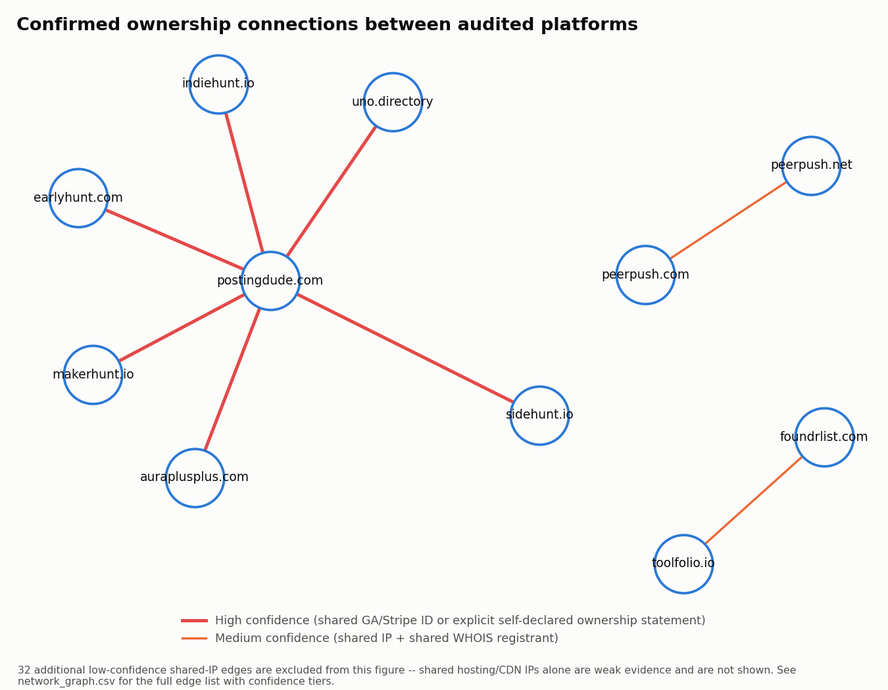
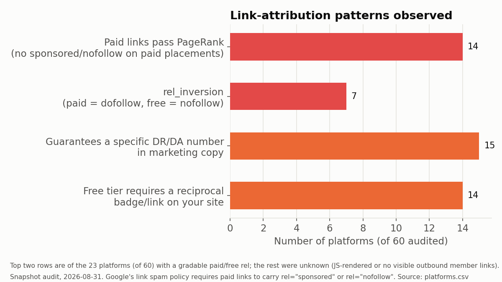

# Launch platform audit

**Snapshot as of 2026-08-31.** Every row in this report reflects what a given
site's public pages showed on that date. Sites change; a platform graded
`rel_inversion=false` today could change its markup tomorrow. Treat this as a
dated snapshot, not a permanent rating.

## Why this exists

Founders are routinely told to submit their product to "launch platforms" and
"startup directories." Dozens of meta-lists rank these by Domain Rating and
dofollow status, but none of them carry a risk column. Some of these platforms
are ordinary directories. Others sell dofollow links, or turn out to be several
sites owned by one operator and sold as if they were independent.

This report is an evidence-based inventory, not a set of opinions. Every claim
below is either a directly observed fact (an HTML `rel` attribute, a price on a
pricing page, a GA measurement ID that appears on two different domains) or is
explicitly marked `unknown`. Nothing here asserts intent — only mechanism. Where
we cite a standard, it is [Google's published link spam
policy](https://developers.google.com/search/docs/essentials/spam-policies#link-spam),
which requires paid links to carry `rel="sponsored"` or `rel="nofollow"`.

## Methodology

Each of the 60 audited domains was fetched with a standard browser user agent
(`/`, `/pricing`, `/submit`, `/robots.txt`, `/privacy`, `/terms` — one
representative listing page where discoverable), politely and sequentially per
host. The raw HTML for every fetch was saved locally as an evidence trail (see
`raw/` — not committed to this public repo; ask for a re-run if you want to
verify a specific row, see **Corrections** below).

From that raw HTML we computed, mechanically:
- outbound `<a>` tag `rel` attributes, split into a "paid" context (near
  headings like premium/featured/spotlight/sponsored/promoted) and a "free"/
  organic listing context
- visible (server-rendered, no-JS) word count, to flag pages that require
  JavaScript to render their real content
- `robots.txt` admission of AI crawlers (GPTBot, ClaudeBot, PerplexityBot)
- GA/GTM measurement IDs, Stripe publishable keys, resolved IPs, and favicon
  hashes, for the ownership-network analysis
- WHOIS registrant/registrar/creation-date data

Business model, dark-pattern, and paid-vs-free classification required reading
the actual page content and context — those columns were graded against the
rubric below with **`unknown` as a fully acceptable answer whenever the
evidence didn't support more**. We did not guess to fill a blank cell.

## Scope

Target: 40–60 platforms (actual: 60). The crawl combined:

- **29 named seeds** (specific launch platforms, the known operator network,
  submission services, and outranking/bidding schemes)
- **31 additional platforms** pulled from the union of four public meta-lists —
  `makerhunt.io/places-to-launch`, `launchigniter.com/submit-directories`,
  `scrolllaunch.com/directories`, and `launchdirectories.com` — deduped and
  capped at the most frequently cross-listed platforms. `seed_list_count` in
  `platforms.csv` records how many of those four meta-lists list each domain, as
  a free prominence signal.

This is a snapshot of a bounded crawl, not an exhaustive census of every launch
platform that exists.

## The rubric

One row per platform in `platforms.csv`. Full column definitions:

| Column | Meaning |
|---|---|
| `platform`, `domain` | Display name and apex domain |
| `audited_at`, `http_status` | Snapshot date; HTTP status of the homepage fetch |
| `seed_list_count` | How many of the 4 meta-lists list this domain |
| `business_model` | `destination` (list on their one site) / `submission_service` (a third party submits you to sites they don't own) / `owned_network` (sells placement on multiple sites the seller owns) / `meta_list` (lists other platforms, sells nothing directly) / `unclear` |
| `paid_link_rel`, `free_link_rel` | `dofollow` / `nofollow` / `sponsored` / `sponsored+nofollow` / `none_observed` / `unknown`, for paid vs. free/organic listing placements |
| `rel_inversion` | `true` if paid placements are `dofollow` **and** free placements are `nofollow` — the key signal Google's policy is built to prevent |
| `paid_passes_pagerank` | `true` if paid placements carry neither `sponsored` nor `nofollow` |
| `guarantees_dr`, `guarantees_dr_quote` | Does marketing copy guarantee a specific DR/DA number, and the verbatim quote |
| `badge_required_free` | Does a free listing require a reciprocal badge/link on your own site |
| `claims_owned_network`, `owner_entity` | Does the site's own text claim to own multiple platforms; the legal/operating entity found in footer, privacy, terms, or WHOIS |
| `network_id_ga`, `network_id_other` | GA/GTM IDs; Stripe publishable keys, resolved IP, favicon hash |
| `price_usd`, `claimed_link_count`, `price_per_link` | Lowest paid tier; claimed placement/backlink count; the derived ratio |
| `server_rendered_words`, `js_required` | Visible words with JS disabled; `true` if under 150 |
| `ai_crawlers_allowed` | Does `robots.txt` admit GPTBot/ClaudeBot/PerplexityBot |
| `claims_unsubmittable_platforms` | Does marketing copy claim to submit you to Product Hunt, Hacker News, Y Combinator, or AppSumo |
| `dark_patterns` | Semicolon list, only from: `countdown_reset_on_deploy`, `placeholder_text_in_prod`, `mockup_presented_as_result`, `undisclosed_self_listing` — only when directly observed in source |
| `evidence_file`, `notes` | Where the raw HTML lives (kept locally, not committed); factual observations |

## Findings

### 1. The ownership graph

The single most useful thing a founder can't get from an existing meta-list:
which nominally independent platforms share an operator.

**PostingDude.com's own marketing copy states, verbatim, in its JSON-LD
structured data and FAQ text:**

> "Content marketing and distribution across six owned platforms every
> month—Aura++, IndieHunt, EarlyHunt, Uno Directory, MakerHunt, SideHunt"

That is an explicit self-declaration — the strongest evidence tier in our
rubric (`confidence: high`). We independently confirmed that all six named
domains (`auraplusplus.com`, `indiehunt.io`, `earlyhunt.com`, `uno.directory`,
`makerhunt.io`, `sidehunt.io`) are live, audited platforms in our seed set, and
that `earlyhunt.com`'s own footer links back to "Posting Dude." None of the six
shares a GA/GTM ID or Stripe key with each other, and their WHOIS records use
different privacy-proxy providers — an operator running six sites under
distinct analytics properties and separately-proxied registrations. The public
self-declaration is what confirms the relationship, not the technical infra.

Two smaller, separate, `medium`-confidence pairs also surfaced from shared IP +
matching WHOIS registrant: `peerpush.com` / `peerpush.net` (independently
confirmed elsewhere — both domains carry the same JSON-LD `legalName:
"PeerPush"` and `peerpush.net`'s canonical tag points at `peerpush.com`; these
read as one product on two TLDs, not two products), and `foundrlist.com` /
`toolfolio.io`.

We also found and discarded a much larger cluster: `foundrlist.com`,
`launchpanda.dev`, `makerhunt.io`, `scrolllaunch.com`, `startupa.ge`,
`tinylaunch.com`, `toolfolio.io`, and `trustmrr.com` all resolved to the same
IP (`216.150.1.1`) at audit time. Per our confidence rubric, a shared hosting
IP alone is `low` confidence — Vercel- and Cloudflare-style shared
infrastructure routinely pools unrelated customers behind one address, DNS for
several of these domains resolved to more than one IP across our own repeated
lookups, and none of these eight domains shares a registrant, GA ID, or Stripe
key. **These 32 low-confidence, shared-IP-only edges are in
`network_graph.csv` for completeness but are excluded from the figure and from
any ownership claim in this section** — they are hosting artifacts, not
evidence of common ownership.

### 2. Rel-attribution compliance

Of the 60 platforms audited, 23 had a codebase where paid vs. free listing
placements could be confidently distinguished from public pages (the rest were
JS-rendered with no visible server-side listing feed, or had no gradable
outbound member links at all — marked `unknown`, not assumed compliant).

- **7 of those 23** show `rel_inversion`: paid placements are `dofollow` and
  free placements are `nofollow`. `earlyhunt.com` is the clearest documented
  case — its own pricing FAQ states free listings get "Nofollow links by
  default" and a required site badge, while the $19 Premium tier gets a
  "Guaranteed dofollow backlink" and no badge requirement; the same pattern is
  directly visible in the outbound link markup on its homepage.
- **15 of 60** platforms guarantee a specific DR/DA number in marketing copy
  (e.g., "Guaranteed Dofollow Backlink (DR 72)"), and **14 of 60** require a
  free listing to carry a reciprocal badge/link back to the platform.
- One counter-example worth naming: `pitchwall.co`'s submit page advertises a
  "Do-follow backlink (DR 70)" on **every** tier including Free, but the
  homepage's actual "New Products" feed — including one item carrying a
  "Featured" badge — served `rel="noopener nofollow"` on the sampled links we
  could check; a separate sponsor ad slot (unrelated to listed products) was
  the one link observed as `dofollow`. That's the opposite failure mode from
  `rel_inversion`: a dofollow claim not backed up by the delivered markup.

### 3. Price-per-link economics

For the platforms that both quote a price and claim a specific
placement/backlink count, price-per-link ranges from roughly **$0.007** to
**$5.00** per placement:

| Platform | Price | Claimed count | Price / link |
|---|---|---|---|
| `launchdirectories.com` | $99 | 15,000 | $0.0066 |
| `scrolllaunch.com` | $19 | 1,017 | $0.019 |
| `launchpanda.dev` | $29 | 267 | $0.109 |
| `tinylaunch.com` | $15 | 110 | $0.136 |
| `uneed.best` | $14.99 | 100 | $0.150 |
| `foundrlist.com` | $29 | 100 | $0.290 |
| `submitsaas.com` | $60 | 140 | $0.429 |
| `startupsubmit.app` | $99 | 220 | $0.450 |
| `listmy.site` | $99 | 100 | $0.990 |
| `aitooltrek.com` | $19.90 | 5 | $3.98 |
| `listingbott.com` | $499 | 100 | $4.99 |

These claimed counts are self-reported by each site and were not independently
verified link-by-link; we report the ratio as stated, not as confirmed.

## The full table

See [`platforms.csv`](platforms.csv) (60 rows, 26 columns — too wide to render
cleanly here) and [`network_graph.csv`](network_graph.csv) for the ownership
edges referenced above.

## Limitations

- **JS-rendered sites are marked `unknown`, not "clean."** 5 of 60 homepages
  rendered under 150 words of visible text with JavaScript disabled
  (`js_required=true`) and were not escalated to a JS-executing browser in this
  pass — that escalation budget (the audit plan allowed up to 8 headless-render
  cases) went unused; a follow-up pass could spend it. More broadly, 28 of 60
  rows are `unknown` on `paid_link_rel` and 34 of 60 on `free_link_rel` —
  either because the page needs JS to render its listing feed, because there
  was no gradable outbound member link on the fetched pages, or because a
  grader could not confidently separate paid from free placements. Do not read
  `unknown` as a clean bill of health.
- **Shared hosting IPs are weak evidence on their own.** See the 32 discarded
  low-confidence edges above — modern CDNs and platforms-as-a-service pool many
  unrelated customers behind one IP.
- **This is a snapshot, not a monitor.** `audited_at` is a single date
  (2026-08-31). Sites redesign, change pricing, and change `rel` attributes.
  Nothing here should be read as a permanent classification.
- **Several pages returned 403/429 responses or a client-rendered empty
  shell** on their homepage (`producthunt.com`, `softwareworld.co`,
  `outbid.lol`, `devhunt.org`, `f6s.com` — the 5 domains where visible text
  with JavaScript disabled came in under 150 words), plus a handful of
  sub-pages on `alternativeto.net` and `theresanaiforthat.com` that hit a
  Cloudflare interstitial rather than serving content. Those rows have most
  non-mechanical columns marked `unknown` rather than inferred from context.
  `outbid.lol` in particular rate-limited every request across two separate
  attempts (`http_status=429` on all pages) and could not be graded beyond
  that.
- **Paid vs. free link classification uses contextual heuristics** (proximity
  to headings like "premium"/"featured"/"sponsored"), not a guaranteed ground
  truth. Where a grader could not confidently separate paid from free
  placements, both columns are `unknown` — see individual `notes` for the
  reasoning per row.
- **The 60-platform cap means this is not exhaustive.** The four seed
  meta-lists collectively referenced 272 unique domains before capping; this
  report covers the top 60 by combined seed-list frequency plus all named
  seeds from the audit plan.

## Corrections

This audit names real companies from public pages on a specific date. If you
operate one of these platforms and believe a row is inaccurate — a price
changed, a `rel` attribute was fixed, evidence was misread — open an issue on
this repository with the domain and the specific column in question, and we
will re-fetch and correct the row. We kept the raw HTML evidence for every row
locally specifically so any claim here can be re-verified against what was
actually served on the audit date.
