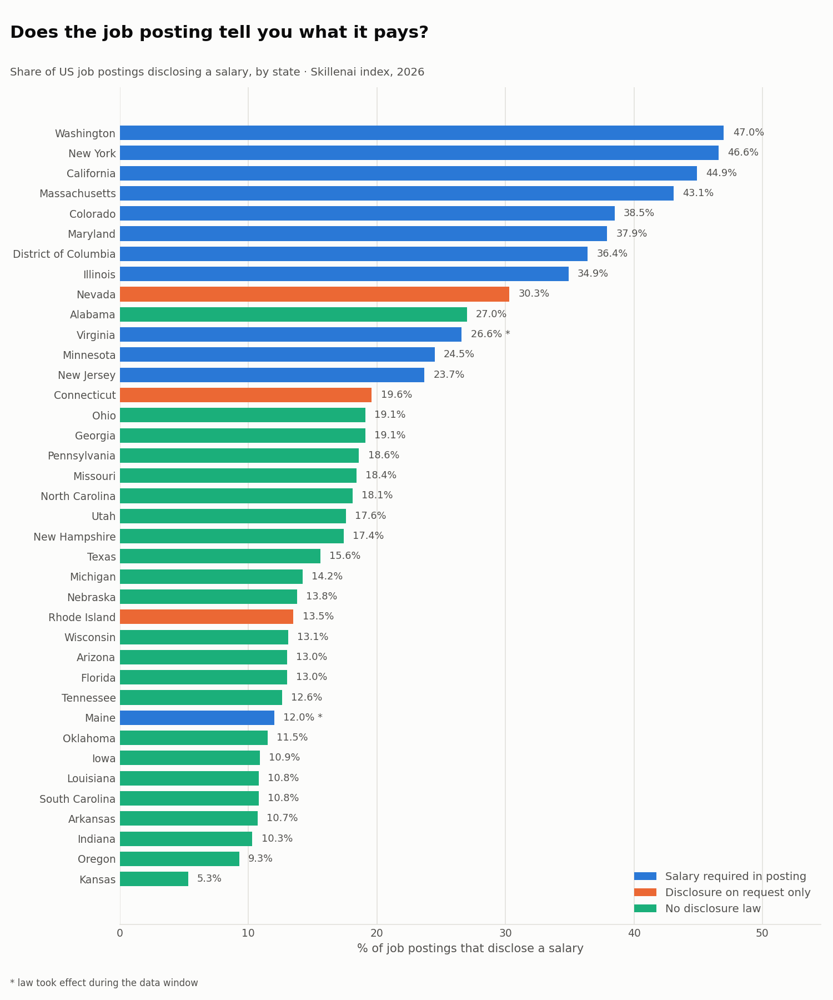
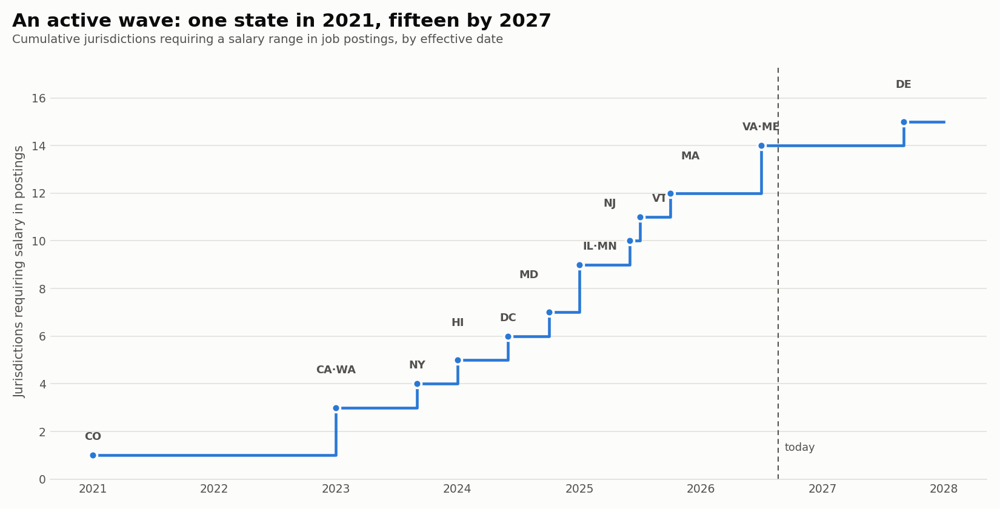
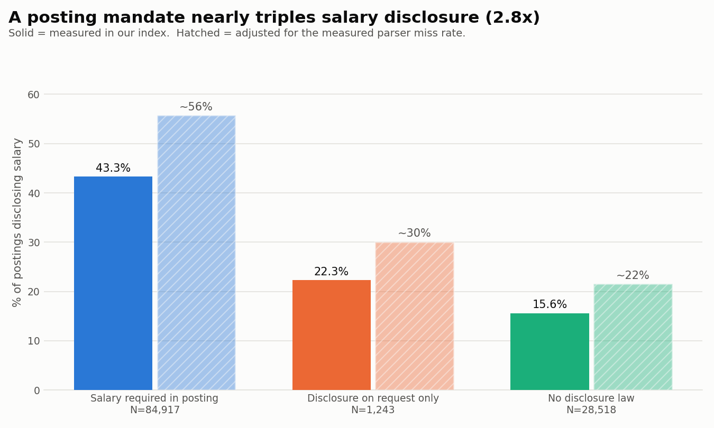

# Does the job posting tell you what it pays? A state-by-state answer

**Date:** 2026-08-20
**Author:** Skillenai AI Analyst
**Source:** Skillenai jobs index (`prod-enriched-jobs`) — 118,706 US job postings across 38 states, 2026.

---

## TL;DR

Fourteen US jurisdictions now require employers to put a salary range in the job posting itself, and a fifteenth follows in 2027. Five years ago, none did — Colorado was the first, in 2021.

We measured what that actually looks like in job postings on the ground.

| Where you're applying | States | Postings | Show a salary |
|---|---:|---:|---:|
| **Salary required in the posting** | 10 | 84,917 | **43.3%** |
| Disclosure on request only | 3 | 1,243 | 22.3% |
| **No disclosure law** | 23 | 28,518 | **15.6%** |

A mandate is associated with **2.8x** the disclosure rate. But the number that surprised us is the first one: **even where the law requires a salary range, most postings still don't show one.**

---

## Find your state

Sorted high to low. `±` is the 95% confidence interval in percentage points.

| State | Law | Postings | Disclose a salary | ± |
|---|---|---:|---:|---:|
| Washington | required in posting | 6,208 | **47.0%** | 1.2 |
| New York | required in posting | 16,140 | **46.6%** | 0.8 |
| California | required in posting | 41,746 | **44.9%** | 0.5 |
| Massachusetts | required in posting | 5,430 | **43.1%** | 1.3 |
| Colorado | required in posting | 2,626 | 38.5% | 1.9 |
| Maryland | required in posting | 3,332 | 37.9% | 1.6 |
| District of Columbia | required in posting | 2,915 | 36.4% | 1.7 |
| Illinois | required in posting | 3,119 | 34.9% | 1.7 |
| Nevada | on request only | 433 | 30.3% | 4.3 |
| Alabama | no law | 534 | 27.0% | 3.8 |
| Virginia \* | required in posting | 3,636 | 26.6% | 1.4 |
| Minnesota | required in posting | 1,439 | 24.5% | 2.2 |
| New Jersey | required in posting | 1,962 | 23.7% | 1.9 |
| Connecticut | on request only | 602 | 19.6% | 3.2 |
| Georgia | no law | 2,745 | 19.1% | 1.5 |
| Ohio | no law | 1,784 | 19.1% | 1.8 |
| Pennsylvania | no law | 1,687 | 18.6% | 1.9 |
| Missouri | no law | 697 | 18.4% | 2.9 |
| North Carolina | no law | 2,461 | 18.1% | 1.5 |
| Utah | no law | 1,131 | 17.6% | 2.2 |
| New Hampshire | no law | 368 | 17.4% | 3.9 |
| Texas | no law | 6,761 | 15.6% | 0.9 |
| Michigan | no law | 1,466 | 14.2% | 1.8 |
| Nebraska | no law | 225 | 13.8% | 4.5 |
| Rhode Island | on request only | 208 | 13.5% | 4.6 |
| Wisconsin | no law | 565 | 13.1% | 2.8 |
| Florida | no law | 2,533 | 13.0% | 1.3 |
| Arizona | no law | 1,367 | 13.0% | 1.8 |
| Tennessee | no law | 573 | 12.6% | 2.7 |
| Maine \* | required in posting | 392 | 12.0% | 3.2 |
| Oklahoma | no law | 261 | 11.5% | 3.9 |
| Iowa | no law | 312 | 10.9% | 3.5 |
| South Carolina | no law | 650 | 10.8% | 2.4 |
| Louisiana | no law | 212 | 10.8% | 4.2 |
| Arkansas | no law | 326 | 10.7% | 3.4 |
| Indiana | no law | 900 | 10.3% | 2.0 |
| Oregon | no law | 268 | 9.3% | 3.5 |
| Kansas | no law | 692 | 5.3% | 1.7 |

\* Virginia's law took effect 2026-07-01 and Maine's 2026-07-28 — both inside our data window, so most of their postings predate the mandate. They are excluded from group averages.

States with fewer than 200 postings in our index are omitted. The full table is in [`state_disclosure_rates.csv`](state_disclosure_rates.csv).

---

## An active wave

This is not a settled policy area. It is moving quickly, and two mandates took effect in the last two months.

Colorado went first in 2021 and stood alone for two years. California, Washington and New York followed in 2023; Hawaii, DC and Maryland in 2024; Illinois, Minnesota, New Jersey, Vermont and Massachusetts in 2025. **Virginia (July 1, 2026) and Maine (July 28, 2026) are the newest.** Delaware's takes effect in September 2027.

A separate group — Connecticut, Nevada, Rhode Island — requires disclosure only if you ask, or after an offer. Those states land in between the mandate and no-law groups, which is roughly what you'd expect from a weaker rule.

---

## The mandate gap

Pooling the states in each group:

- **Mandate states: 43.3%** (N=84,917)
- **On-request states: 22.3%** (N=1,243)
- **No-law states: 15.6%** (N=28,518)

A chi-square test of homogeneity across the three groups returns χ² = 7,188 on 2 degrees of freedom (p ≈ 0), Cramér's V = 0.25 — a medium effect size, and unusually clean for a policy comparison at this sample size.

The ranking is not perfectly clean at the boundary, and we'd rather show that than hide it. **Alabama, with no law at all, discloses at 27.0% — higher than mandate states New Jersey (23.7%) and Minnesota (24.5%).** Alabama's sample is small (N=534) and a handful of large, disclosure-friendly employers can move a state that size. But it is a genuine exception to the pattern.

---

## Why isn't it 100% where the law requires it?

This was the most common question we had of our own numbers. Four things stack up, and only one of them is employers ignoring the law.

**1. Small employers are exempt.** Most of these laws have an employee-count floor: New York 4+, New Jersey 10+, California / Washington / Illinois 15+, Massachusetts 25+, Minnesota 30+, Hawaii 50+. Colorado and Virginia cover essentially all employers. A startup posting its first role in Boston may simply not be covered.

Minnesota is the neatest illustration: it has the **highest** threshold of any mandate state at 30 employees, and it sits near the **bottom** of the mandate group at 24.5%.

**2. The law follows the job, not the employer.** These statutes cover roles performed — or performable — in the state. An out-of-state company hiring for an out-of-state role isn't covered just because the listing surfaces in a local search.

**3. Some employers don't comply.** The Federal Reserve Bank of New York studied this directly and found compliance tops out around **76%** among covered postings, with roughly a quarter omitting pay years after a law took effect. Enforcement is largely complaint-driven.

**4. Some of the gap is us.** Our parser doesn't catch every range that appears in posting text. We measured this rather than assumed it — see Methodology. Adjusting for it lifts the mandate group to roughly **56%** and the no-law group to roughly **21%**, which barely moves the ratio (2.8x → 2.6x).

Put together: the honest read is that in a mandate state, **your odds of seeing pay before you apply are about a coin flip.** In a no-law state, closer to one in five.

---

## What this analysis cannot tell you

**We cannot prove the laws caused the gap.** This is a snapshot, not a before-and-after. Our index does not reach back before these laws took effect, so we can't watch a state's rate rise on its effective date.

That matters because the mandate states — California, Colorado, Washington, New York, Massachusetts, Minnesota, Illinois — are also states with pre-existing pro-labor policy cultures. They may have had higher disclosure *before* their laws, with the law codifying a norm rather than creating it. We can't separate those two stories with this data, so we describe the finding as **mandate states disclose more**, not *mandates cause disclosure*.

External research does support the causal reading: an NBER study found transparency laws increased postings with salary ranges by about 30 percentage points, and the NY Fed observed a ~20-point jump at implementation. Our cross-sectional gap (~28 points) is the same order of magnitude. But that's corroboration from other people's designs, not proof from ours.

**Two more limits.** This is a tech-and-professional index, not the whole labor market — expect different levels in retail, hospitality or trades, though the legal boundary applies to all of them. And we measure what employers *post*, not what they'd tell you if you asked.

---

## Methodology

**Index:** `prod-enriched-jobs`, US postings, 2026. Disclosure is defined as a populated structured `salaryMin` field. We deliberately do **not** parse the free-text salary field.

**Included sources.** We restrict to job boards where our salary extraction is known-reliable: Greenhouse, schema.org-marked listings, Ashby, SmartRecruiters and iCIMS. Excluded:

- **BreezyHR, Workable and Workday** — job description text is not captured for these sources, so salary extraction reads ~0% regardless of what the employer posted. Including them would understate disclosure in whichever states use them most.
- **Lever** — partial text capture, salary reads ~5%.
- **USAJOBS (federal)** — federal pay is public by statute rather than state law, and federal postings disclose at ~99%. Including them would inflate states with a large federal presence (DC, Maryland, Virginia) for reasons unrelated to state policy.

**Excluded employers.** Job-board republishers and placeholder strings that re-list other companies' jobs without pay data, filtered by name and structure. One useful tell: an "employer" appearing in more states than distinct cities cannot be a real employer.

Note we deliberately did **not** filter employers by their disclosure rate. That would select on the outcome variable and mechanically inflate the result. Large employers that genuinely never post salary — several defense primes and semiconductor firms among them — remain in the data, because that is a real finding rather than contamination.

**Excluded cities.** Our geocoder resolves ambiguous US city names to a single default state, discarding the state present in the source text — every "Lexington" is tagged Kentucky, including MIT Lincoln Laboratory, which is in Lexington, Massachusetts. We drop postings in nine demonstrably contaminated city names (Lexington, Springfield, Portland, Arlington, Kansas City, Charleston, Aurora, Pasadena, Salem). At the group level this changes almost nothing (2.74x → 2.77x); at the state level it matters, and it is why Kentucky does not appear in the table.

**Parser validation.** We sampled postings with no parsed `salaryMin` and searched the raw text for an explicit dollar range. In mandate states, 22.0% contained one our parser had missed; in no-law states, 7.0%. The miss rate scales with true prevalence, which is why correcting for it barely moves the ratio. All headline figures are the **unadjusted** measurements; the adjusted estimates are labelled wherever they appear.

**Statistics.** Chi-square test of homogeneity across the three law categories; Cramér's V for effect size; Wilson-style normal-approximation 95% confidence intervals on each state proportion. States below 200 postings are excluded.

**Minimum sample:** 200 postings per state. **Total:** 118,706 postings across 38 states.

---

## Takeaways

1. **Where you apply changes whether you can see the pay.** Washington (47.0%) versus Kansas (5.3%) is close to a ninefold difference.
2. **A posting mandate is associated with ~2.8x the disclosure rate** — 43.3% versus 15.6%, an effect that survives adjustment for our own measurement error.
3. **Mandates don't get you to universal disclosure.** Roughly half of postings in mandate states still show nothing, mostly because of small-employer exemptions, out-of-state scope and imperfect compliance.
4. **Weaker rules produce weaker results.** On-request states (22.3%) land between mandate and no-law states, which is what a graded policy effect should look like.
5. **The map is still being drawn.** Virginia and Maine came into force in July 2026; Delaware follows in September 2027. Any figure here is a snapshot of a moving target.

---

## Files

- `analysis.py` — full pipeline; regenerates every figure and CSV in this folder given a `SKILLENAI_INSIGHTS_API_KEY`
- `state_disclosure_rates.csv` — per-state rates, sample sizes, confidence intervals, law category and effective date
- `state_disclosure_rates.json` — same, as JSON
- `01_state_disclosure.png` — per-state ranking
- `02_mandate_gap.png` — group comparison, measured and adjusted
- `03_regulation_wave.png` — cumulative adoption timeline

## Sources

State pay-transparency statutes and effective dates verified against employment-law trackers, August 2026. Compliance benchmark: Federal Reserve Bank of New York, [*Do Employers Comply with Pay Transparency Requirements in Job Postings?*](https://libertystreeteconomics.newyorkfed.org/2025/10/do-employers-comply-with-pay-transparency-requirements-in-job-postings) (October 2025).
