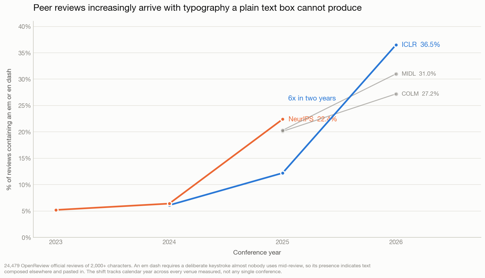
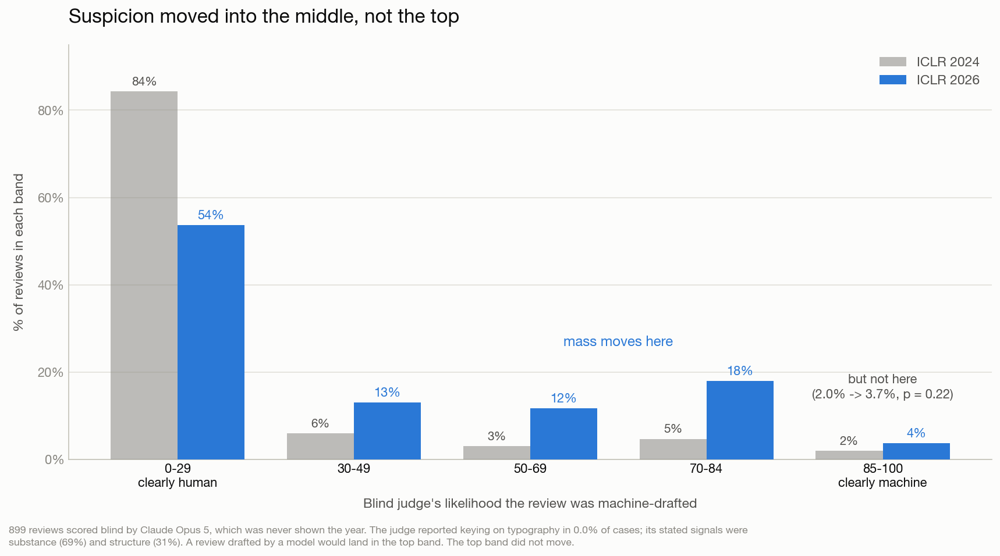
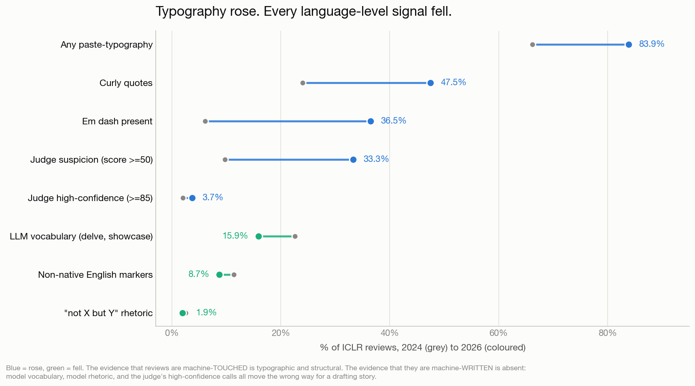
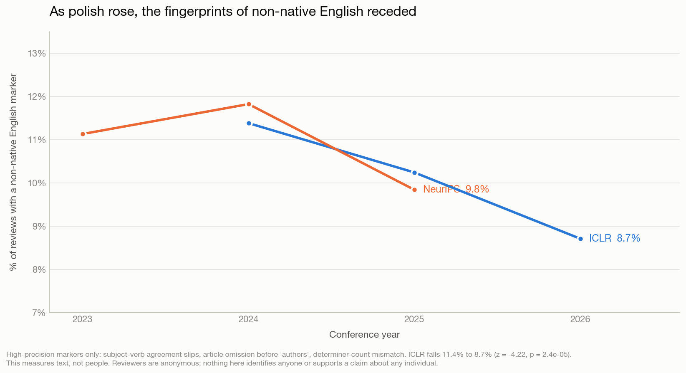
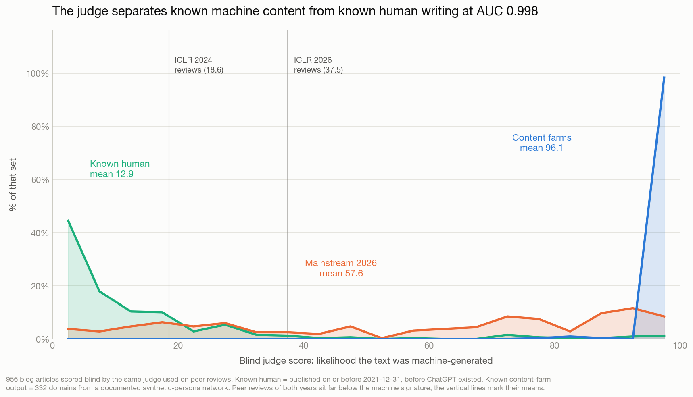

# Peer review is being polished by AI, not written by it

**Date:** 2026-09-09
**Source:** OpenReview public API (`notes/search`), 33,844 review and meta-review notes from ICLR, NeurIPS, COLM and MIDL, 2023–2026
**Companion analysis:** [`arxiv-ai-flood/`](https://github.com/skillenai/skillenai-notebooks/tree/master/arxiv-ai-flood) established that arXiv paper volume is driven by researcher headcount, not machine generation. This report looks at what the same researchers do when they review.

---

## TL;DR

A widely-shared complaint from a long-time reviewer holds that machine-learning conferences have become "Track Chairs using AI to synthesize AI reviews of AI generated papers." We tested the review half of that claim on 24,479 OpenReview peer reviews.

Something did change, sharply, and it is measurable:

- **Reviews increasingly arrive with typography a plain text box cannot produce.** Em dashes appear in **6.1% of ICLR 2024 reviews and 36.5% of ICLR 2026 reviews** — a 6× rise, with every year-over-year step significant at p < 1e-22.
- **It is not one conference.** NeurIPS, COLM and MIDL all show the same shift. The pattern tracks calendar year, not venue.

But the evidence that reviews are being *written* by machines is absent, and several signals point the other way:

- **A blind judge's high-confidence calls did not move.** Reviews scored 85+ on a 0–100 machine-drafted scale went 2.0% → 3.7% (**p = 0.22**). The suspicion that rose was in the *middle* of the range, not the top.
- **Model vocabulary fell.** `delve`, `showcase`, `underscore` and their family dropped from 22.6% to 15.9% of reviews.
- **Model rhetoric fell.** The "not X, but Y" construction went 2.5% → 1.9%.
- **Non-native English markers fell by a quarter**, 11.4% → 8.7% (z = −4.22, p = 2.4e-05).
- **The judge was calibrated against known machine content** and separates it from known-human writing at **AUC 0.998** (section 7).

> **Reviewers are not sending machines to do their thinking. They are sending their thinking through a machine on the way out.**

The last finding reframes the whole thing. Over exactly the window when polish rose, the grammatical fingerprints of non-native English receded — which is what you would expect if the researchers adopting these tools are disproportionately the ones for whom writing English is work.

---

## 1. Typography: the signal that rose

An em dash (—) requires a deliberate keystroke — option-shift-hyphen on macOS, an alt code on Windows — that almost nobody uses while typing into a review box. Curly quotes come from Word, Google Docs, or a chat interface. Neither is produced by typing into OpenReview's plain `<textarea>`. Their presence means the text was composed somewhere else and pasted in.

| Venue | 2023 | 2024 | 2025 | 2026 |
|---|---:|---:|---:|---:|
| **ICLR** | — | 6.1% | 12.2% | **36.5%** |
| **NeurIPS** | 5.2% | 6.4% | **22.4%** | — |
| **COLM** | — | — | 20.1% | 27.2% |
| **MIDL** | — | — | 20.3% | 31.0% |

All figures are length-matched to reviews of 2,000+ characters. ICLR's year-over-year steps: 2024→2025 z = +9.87 (p = 5.8e-23), 2025→2026 z = +29.39 (p = 7.7e-190).

Two robustness checks matter here:

**It is not a length artifact.** Em-dash *density* rose from 0.34 to 2.89 per 10,000 characters — an 8.4× rise, steeper than the presence rate. Reviews did not merely get longer.

**It is not one venue's culture.** An earlier draft of this analysis concluded the shift was ICLR-specific, based on NeurIPS 2023 and 2024 alone. Adding NeurIPS 2025 falsified that: it jumped to 22.4% over the same window. The effect tracks the calendar.

Other typographic signals corroborate: curly quotes 24.0% → 47.5%, markdown bold 13.1% → 20.1%, any paste-typography 66.2% → 83.9%.

---

## 2. The crux: polishing or drafting?

Typography establishes that text was composed outside the review box. It cannot distinguish a reviewer who pasted their own review through a model for grammar from one who asked a model to write the review.

That distinction is the entire question, so we tested it directly. We had Claude Opus 5 score 899 reviews blind — never shown the venue or year — on a 0–100 scale for how likely the review was substantially machine-drafted, with instructions to judge the writing rather than the review's quality, and to treat specific engagement with the paper as strong evidence of a human.

| Band | ICLR 2024 | ICLR 2026 |
|---|---:|---:|
| 0–29 (clearly human) | 84.3% | 53.7% |
| 30–49 | 6.0% | 13.0% |
| 50–69 | 3.0% | 11.7% |
| 70–84 | 4.7% | **18.0%** |
| **85–100 (clearly machine)** | **2.0%** | **3.7%** |

Moderate suspicion more than tripled — reviews scoring 50 or above went from 9.7% to 33.3% (z = +7.35, p < 1e-5). But the **top band did not move**: 2.0% → 3.7%, z = +1.23, **p = 0.22**.

The mass moved out of "clearly human" and into the middle. It did not arrive at "clearly machine."

That is the signature of polishing. A review drafted by a model — generic praise, no engagement with the actual paper, symmetric scaffolding over nothing — would land in the top band. The top band is where the drafting story would show up, and it is flat.

**The judge is not reading punctuation.** It reported keying on typography in **0.0%** of cases; its stated signals were substance (69%) and structure (31%). Reviews containing em dashes score only 13 points higher than those without in 2026, and *lower* in 2024. This is independent of the typography finding rather than a restatement of it.

What did rise in the judge's reasoning is telling: structure-based judgements went from 6.7% to 31.0%, with stated reasons like *"highly symmetric strengths/weaknesses scaffolding with bolded generic headings"* and *"uniformly fluent bulleted structure."* Symmetric scaffolding and bolded headers are what a model produces when it reformats notes it has been given. They are not what fabrication looks like.

---

## 3. Every language-level signal moved the wrong way for a drafting story

If reviews were increasingly machine-written, model vocabulary and model rhetoric should rise alongside typography. Both fell.

| Signal | 2024 | 2026 | Direction |
|---|---:|---:|---|
| Any paste-typography | 66.2% | 83.9% | up |
| Curly quotes | 24.0% | 47.5% | up |
| Em dash | 6.1% | 36.5% | up |
| Judge suspicion (≥50) | 9.7% | 33.3% | up |
| Judge high-confidence (≥85) | 2.0% | 3.7% | flat (p = 0.22) |
| Model vocabulary (`delve`, `showcase`) | 22.6% | 15.9% | **down** |
| Non-native English markers | 11.4% | 8.7% | **down** |
| "not X, but Y" rhetoric | 2.5% | 1.9% | **down** |

`delve` — the most-cited machine-writing tell of the 2023 era — fell from 3.1% to 0.4% of ICLR reviews. This has an obvious reading: newer models were trained away from the vocabulary that made them detectable, while nobody optimised against their punctuation habits. Which means **every vocabulary-based detector is decaying**, and our typography numbers are a floor rather than a ceiling.

---

## 4. Who is doing the polishing

Machine polish is most useful to people for whom writing fluent English is work. That yields a falsifiable prediction: the surface features that polish removes should decline over the same window that polish rises.

They do. Every high-precision marker falls monotonically across all three ICLR years:

| Marker | 2024 | 2025 | 2026 |
|---|---:|---:|---:|
| Plural agreement slip | 6.57% | 5.87% | 5.11% |
| Third-person singular agreement slip | 2.83% | 2.67% | 2.21% |
| "authors" without "the" | 1.31% | 1.14% | 0.88% |
| Superlative without "the" | 0.27% | 0.25% | 0.11% |
| **Any marker** | **11.38%** | **10.24%** | **8.71%** |

The composite falls by roughly a quarter (z = −4.22, p = 2.4e-05).

Markers were restricted to constructions that are ungrammatical in standard English — subject-verb agreement failures, article omission before a definite noun, determiner-count mismatch. Many major languages of the machine-learning research community (Chinese, Japanese, Korean, Russian and the Slavic family) have no articles, which is why article and agreement errors are the highest-precision signal available.

**This measures text, not people.** Reviewers on OpenReview are anonymised per submission; nothing here identifies anyone, and nothing here supports a claim about any individual reviewer. A corpus-level correlation is consistent with the hypothesis without proving it — reviewer demographics could also have shifted, though not plausibly by a quarter in two years.

The implication is uncomfortable for the slop narrative. The tell that a fluent English speaker notices — smooth, symmetric, em-dash-laden prose — may be picking out precisely the reviewers who had the most to gain from the tool and the least to do with laziness. A community that treats polish as a proxy for effort will disproportionately penalise non-native speakers.

---

## 5. Volume: submissions are outgrowing the research base

Reviewer signatures embed the submission number (`.../Submission19846/Reviewer_Z5SQ`), so venue size can be estimated with the German tank estimator (`M = max·(k+1)/k − 1`) without any privileged access.

| Venue | 2023 | 2024 | 2025 | 2026 | Growth |
|---|---:|---:|---:|---:|---:|
| ICLR | — | 9,500 | 14,296 | **25,653** | **2.70×** |
| NeurIPS | 15,591 | 21,773 | 29,328 | — | 1.88× |

These count submission *slots*, including withdrawn and desk-rejected papers, so they run above published accept-track figures; the ratios are the usable part. For context, arXiv AI submissions grew roughly 1.5–1.6× over a comparable two-year window. **Conference submissions are growing faster than the underlying research output.**

---

## 6. What we could not measure

Four negative results, reported because each is a trap someone else will fall into.

**Open-source neural detectors point the wrong way.** We scored reviews with the GLTR/DetectGPT family under GPT-2. If reviews were increasingly machine-written they should become *more* predictable — lower perplexity, higher GLTR top-10. ICLR 2026 reviews are **less** predictable on both (mean NLL 3.60 → 3.85). We tested the obvious confound — GPT-2 never saw post-2022 vocabulary — by restricting to reviews containing no modern terminology, and to reviews mentioning only "transformer." The gap survives both (+0.19 and +0.23 versus +0.21 overall). The detector is not confounded; it is miscalibrated. "Machine text has low perplexity" was established against GPT-2-era output, and 2026 model prose is out of distribution for a 2019 scorer.

**The paper-versus-review comparison cannot use typography.** arXiv abstracts contain **0.0%** unicode em dashes and 0.0% curly quotes, against 36.5% and 47.5% in reviews. This is LaTeX normalisation, not evidence that papers are cleaner: the TeX pipeline converts `—` to `---` before we ever see it. Anyone comparing the two corpora on typography will "prove" a spectacular asymmetry that is entirely an artifact.

**Reviewer workload is not measurable.** Signatures are anonymised per submission — the same human receives a different identifier on every paper, and only 19 persistent profile identifiers appear across 33,844 notes. Papers-reviewed-per-reviewer cannot be recovered from public data at any sample size.

**Reviews per submission is not identifiable from a term-sampled corpus.** A zero-truncated binomial fit ran to the grid boundary in every venue, meaning the data cannot distinguish "4 reviews sampled at p = 0.10" from "8 at p = 0.05." With roughly 80% of forums showing exactly one sampled review, the observed distribution carries almost no information about the true count.

Meta-reviews were collected (1,433 of them) but are reported here only in passing: the blind judge scores them highest of all (mean 52.9), and we do not trust that number. The judge's criteria include "generic, restates rather than evaluates," which describes what a meta-review *is*. Supporting that read, the shortest and most summary-like official reviews also score elevated. That is a genre confound, not a finding.

---

## 7. Is the judge trustworthy? A calibration against known machine content

The blind judge carries a lot of weight in section 2, and an uncalibrated judge is just an
opinion with a number attached. So we tested it against content whose provenance we know.

Three labelled sets of blog articles, scored by the same judge, same 0-100 scale, same
criteria, with the genre noun swapped from "review" to "article":

| Set | n | Label quality | Mean | Median | >=70 | >=85 |
|---|---:|---|---:|---:|---:|---:|
| **Known human** (published <= 2021-12-31) | 319 | **Ground truth** -- ChatGPT launched 2022-11-30 | **12.9** | 6 | 5.0% | 2.5% |
| Mainstream 2026 publications | 319 | Presumed mostly human; *not* ground truth | 57.6 | 68 | 48.6% | 29.8% |
| **Known content-farm output** (332 denylisted domains) | 318 | Domain-level label | **96.1** | 97 | **100.0%** | 98.7% |

**Discrimination (AUC, where 0.5 is a coin flip):**

| Comparison | AUC |
|---|---:|
| Known machine vs known human | **0.998** |
| Known machine vs mainstream 2026 | 0.971 |
| Mainstream 2026 vs known human | 0.887 |

At the >=70 threshold the judge catches **100% of known content-farm output** while flagging
**5.0% of pre-ChatGPT human writing**. It is not returning noise, and it is not merely
detecting "2026-ness" -- it separates farm content from era-matched mainstream publications
at 0.971.

**What this establishes for section 2.** ICLR reviews of both years sit far below the machine
signature: 2024 at a mean of 18.6, close to the 12.9 human baseline; 2026 at 37.5. Neither
resembles the 96.1 of genuine machine-generated text. More importantly, the load-bearing
result in section 2 was the **flat top band**, and calibration shows that is exactly where
this instrument is most decisive -- it places 98.7% of real machine content above 85. If ICLR
2026 reviews were being drafted by models at scale, the band the judge is best at would have
moved. It did not.

**What it does not establish.** Two limits, both real:

*Genre transfer.* Content-farm output is fully generated, low-effort SEO filler. The
peer-review question is polish versus drafting -- a much finer distinction in a different
genre. A judge can ace the first and still be imprecise on the second. This is a floor test:
failing it would have invalidated section 2; passing it does not transfer calibration.

*Era drift.* Mainstream 2026 publications score 57.6 -- 4.5x the human baseline, and nearly
half the known-slop score, with 48.6% above 70. Either real publications are heavily
AI-assisted in 2026, or the judge partly keys on stylistic conventions that became common
after 2022 regardless of authorship. We cannot separate those, because the known-human
control is confounded the same way: it is both pre-AI *and* older writing. Era drift would
inflate 2026 scores for reasons other than authorship, which is precisely the comparison
section 2 makes -- so some of the 18.6 -> 37.5 rise in mean score may not be authorship at
all. It cannot explain the flat top band, since drift would push that up too.

**One label-quality note.** The 333-domain denylist contains `dev.to`, a legitimate developer
community, with 183 documents. It was excluded from the positive set; leaving it in would have
put genuine human writing into "known slop". Every other domain in the list matches the
cheap-cloud-domain pattern of the documented network. That is a 1.5% contamination rate in
the seed list, worth knowing for anyone else reusing it.

---

## Methodology

**Collection.** OpenReview's `/notes` endpoint is behind a bot challenge; `/notes/search` is not. Search requires a non-empty query term, so the corpus was assembled from ~90 query terms and deduplicated by note id, then supplemented with venue-targeted pulls via `group=`. This introduces term-selection bias, which is acceptable for per-review text properties and **not** acceptable for estimating venue totals — hence the separate German-tank approach in section 5.

**Length matching.** Every comparison uses reviews of 2,000+ characters, so that shifts in review length cannot masquerade as shifts in composition.

**Statistics.** Two-proportion z-tests throughout. An earlier version of this analysis used confidence-interval overlap as a significance test; that is a conservative heuristic, not a test, and it misclassified a real effect (CIs overlapping by 0.06pp where the z-test gave p = 0.006).

**The blind judge.** Claude Opus 5, structured outputs (never JSON parsed from prose), effort `low`, 899 reviews balanced across ICLR 2024 reviews, ICLR 2026 reviews, and ICLR 2026 meta-reviews, shuffled, with labels attached only after scoring. The judge was asked for the single strongest signal it used, specifically so that circularity with the typography finding could be checked. It reported typography in 0.0% of cases.

**Non-native English markers.** An earlier pass reported these *rising*; two of its patterns were false-positive machines (`paper proposes` catches "**This** paper proposes"; `proposed method` catches "**the** proposed method") and, being high-frequency, dominated the composite. Restricting to constructions that are genuinely ungrammatical reverses the result. The corrected marker set is in `esl_markers.csv`.

**What none of this establishes.** Typography and structure show text composed outside the review box. That includes machine drafting, machine polishing, and drafting in Word. The blind judge is the only instrument here that addresses substance, and it is a single model's judgement, not ground truth.

---

## Reproducing this

All collection and analysis code is in [`scripts/`](scripts/), with a README covering the
run order and configuration. The OpenReview collector needs no account.

## Files

| File | Contents |
|---|---|
| `typography_by_venue.csv` | Em dash, curly quote, any-typography and model-vocabulary rates by venue-year |
| `llm_judge_scores.csv` | Per-review blind judge scores, signal type, and stated primary signal |
| `esl_markers.csv` | Non-native English marker rates by venue-year |
| `submission_volume.csv` | German-tank submission estimates by venue-year |
| `judge_calibration.csv` | Per-article calibration scores for the three labelled sets |

Raw collected notes (33,844 records) are not committed for size reasons; available on request.
