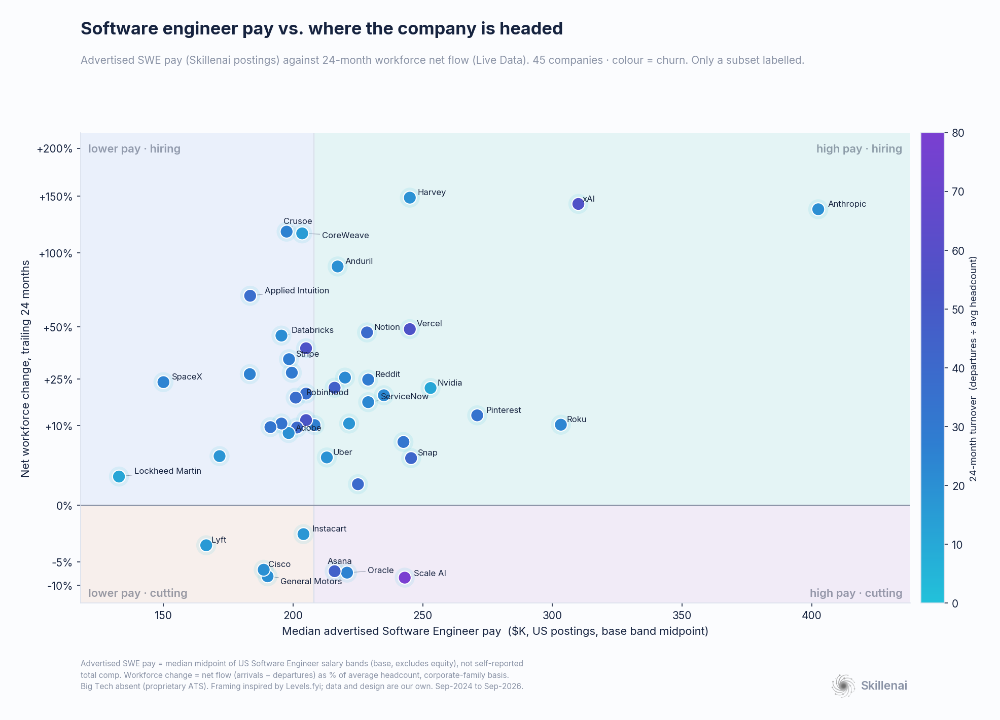
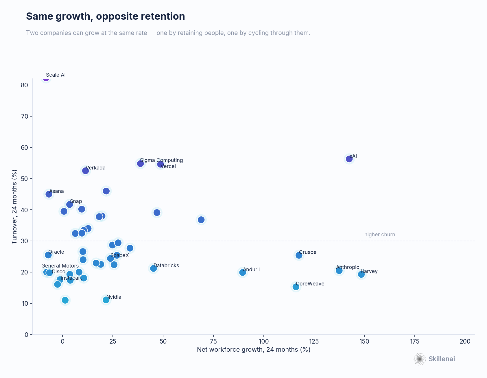
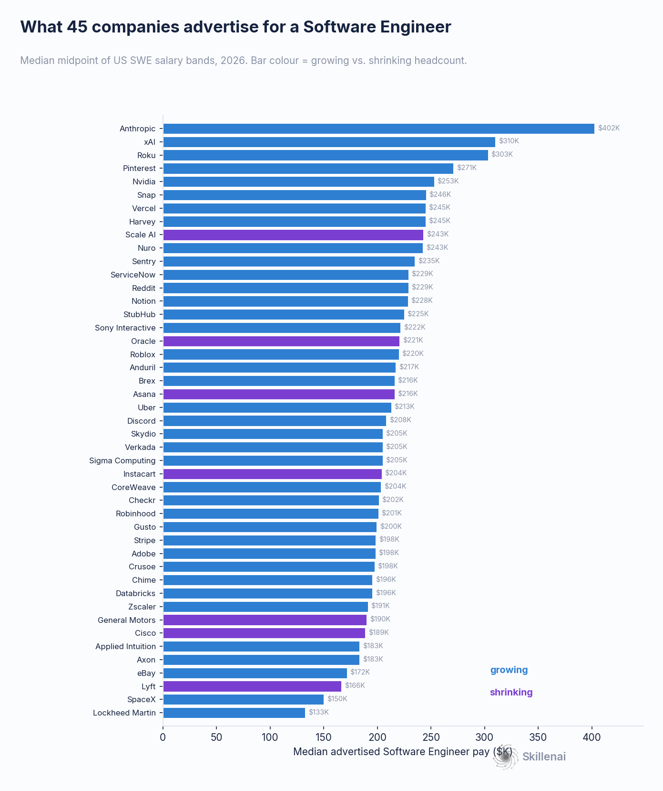

# Software engineer pay vs. company trajectory: an independent map of 45 employers (2026)

**Skillenai × Live Data (+ Skillenai's own talent graph) · advertised software-engineer pay vs. workforce trajectory · refreshed 2026-09-03**

Earlier this year the team at **[Levels.fyi](https://www.levels.fyi/)** shared a chart — *"Where should I work as a SWE?"* — plotting senior-SWE pay against how much each company had grown or cut over 24 months, and made a sharp point: in a volatile market, **the offer number on its own stopped being enough to answer where you should go.** We rebuilt that picture from *different data* to see whether it holds, and this is the refreshed, expanded version.

Two things are new since our first pass. First, everything is updated to a **September 2026** window (the pay data grew ~28%, and marquee names like NVIDIA, Uber, Oracle, ServiceNow and xAI now clear our coverage bar). Second, we now cross-check the trajectory axis against **Skillenai's own talent graph** — an independently-built supply-side dataset — alongside Live Data.

Short version: **Levels' conclusion holds up even more cleanly on refreshed data.** Advertised pay and company trajectory are, statistically, independent. And two extra signals — turnover, and now median tenure from our own graph — separate companies that look identical on a pay-and-growth chart into very different bets.

---

## What's different about our measurements (read this first)

This is **not** a reproduction of Levels' numbers:

- **Pay = advertised, not total comp.** Our x-axis is the **median midpoint of advertised US "Software Engineer" salary bands** (base; **excludes equity, bonus, self-reported figures**). Levels measures self-reported *total* comp with equity. Our Anthropic (~$402K) and Levels' Anthropic (~$800K TC) measure different things — compare *positions*, not dollar *levels*. Reassuringly, the rank order is stable and Anthropic tops both.
- **Trajectory = continuous net flow.** Net flow (arrivals − departures) over 24 months as a share of average headcount, from Live Data's supply-side panel, corporate-family basis.
- **A third, owned source.** We corroborate direction and add **median tenure** from Skillenai's own talent graph (built from public professional profiles). It's ~0.35% of the workforce, so we use it only where coverage is adequate — never as the headline axis.
- **Company set.** Big Tech is still mostly absent from the pay axis (Google, Meta, Apple, Microsoft, Amazon use proprietary applicant systems we don't index), though NVIDIA, Uber, Oracle, ServiceNow and Snap now clear the bar. The set skews scale-up and defense-tech. Every qualifying company is plotted; only a recognizable subset is labelled.

Read positions as *directional*. Per-company posting counts range from ~19 to ~630.

---

## The map

Four quadrants, plain labels: **high pay · hiring** (top-right), **lower pay · hiring** (top-left), **high pay · cutting** (bottom-right), **lower pay · cutting** (bottom-left). Vertical line = median advertised SWE pay (~$208K); horizontal line = zero net change.

### Finding 1 — Pay predicts trajectory even less than before

Across 45 companies, the correlation between advertised SWE pay and 24-month workforce change is **statistically zero** (Spearman ρ = 0.18, p = 0.25; drop the outlier Anthropic and it's ρ = 0.12, p = 0.44). This is *weaker* than our July read — with fresh data and new entrants, any hint of a pay-equals-safety signal has vanished. Knowing what a company pays a software engineer tells you nothing about whether it's growing or shrinking. The information is in *where a company sits on the map*.

### Finding 2 — Three AI labs, three different bets

The high-pay / hiring corner is dominated by AI labs — but they are **not interchangeable**:

- **Anthropic**: ~$402K, **+138%** headcount, 20% turnover. Richest and fastest-growing.
- **xAI**: **$310K (highest advertised pay in the set)**, +142% growth — but **56% turnover**, the churn of a company scaling explosively and cycling people just as fast.
- **NVIDIA**: $253K, +22% growth, and the **lowest turnover in the set (11%)** — the "well-paid, growing, *and* stable" bet the others don't offer.

The pay-vs-stability trade-off doesn't bind at the top of the market — but *retention* clearly separates these three.

### Finding 3 — High pay, shrinking headcount: Scale AI, sharper than ever

**Scale AI** is the clearest "high pay, cutting" case: ~$243K but **net −8%** and the **highest turnover in the set — 82%** (up from 77% in the spring), with a median tenure of just **8 months** on our own graph. We again checked whether the churn is just staff relabeling to Meta after the 2025 deal — it isn't. Tracing 372 leavers with a recorded next employer, **the #1 destination is now Mercor, a direct data-labeling rival; Meta is ~13%.** No destination cracks 15%. It's a genuine post-deal unwinding — customers pulled work after the Meta stake, and talent dispersed to the competitors who picked it up.

### Finding 4 — Two retention signals a layoff flag can't see

Continuous flow lets us add **turnover**, and our own graph adds **tenure** — together they reveal *how* a company is growing or shrinking.

- **Durable growth vs. churn-and-burn**: Databricks (+45%, 21% turnover) and Vercel (+49%, **55%** turnover) grow at the same rate but are opposite bets. The clean durable-growth cluster is Anthropic, NVIDIA, Anduril, CoreWeave, Databricks, Harvey.
- **Type of shrinkage** (from owned-graph tenure): Scale AI shrinks with an **8-month** median tenure — rapid in-and-out churn. General Motors and Cisco also shrink, but at **~24-month** tenure — a slow decline of a long-tenured workforce. Same negative flow, opposite mechanism.

### Finding 5 — Legacy giants drift, new defense-tech climbs

The lower/high-pay cutting rows hold the established names: **Oracle (−7%), General Motors (−8%), Cisco (−7%), Lyft (−2%), Instacart (−1%)**. Against them, a **new-defense / hard-tech cluster hires hard**: **Anduril (+89%), Applied Intuition (+69%), Axon (+27%), SpaceX (+24%), Skydio (+20%)**. Old defense (Lockheed, ~flat) vs. new defense (Anduril, +89%) remains one of the sharpest contrasts on the map.

---

## What Skillenai's own talent graph adds

The trajectory axis is Live Data's. But we now hold an independently-built talent graph, and it earns two roles here:

1. **Cross-source validation.** For the companies where our graph has adequate coverage, its net-flow **sign agrees with Live Data in 18 of 19 cases** (the lone exception, Rivian, is within noise). Two separately-sourced supply-side datasets agreeing is strong corroboration that the map isn't an artifact of one vendor.
2. **Median tenure** — the churn-*type* signal in Finding 4, which neither the pay axis nor net-flow exposes.

We deliberately keep the owned graph in a supporting role: it samples ~0.35% of the workforce, so we report tenure only for companies with adequate coverage, and read low tenure as *churn* only when it is paired with negative flow (fast growth also lowers tenure — e.g. Roblox's low tenure is hiring-driven, not attrition).

---

## Full data

| Company | Adv. SWE pay | SWE N | Net Δ 24mo | Turnover | Owned tenure (mo) | Quadrant |
|---|--:|--:|--:|--:|--:|---|
| Anthropic | $402K | 253 | +138% | 20% | — | high pay · hiring |
| xAI | $310K | 30 | +142% | 56% | — | high pay · hiring |
| Roku | $303K | 31 | +10% | 24% | — | high pay · hiring |
| Pinterest | $271K | 38 | +13% | 34% | 13 | high pay · hiring |
| Nvidia | $253K | 37 | +22% | 11% | 13 | high pay · hiring |
| Snap | $246K | 19 | +4% | 42% | — | high pay · hiring |
| Harvey | $245K | 53 | +148% | 19% | — | high pay · hiring |
| Vercel | $245K | 34 | +49% | 55% | — | high pay · hiring |
| Scale AI | $243K | 73 | -8% | 82% | 8 | high pay · cutting |
| Nuro | $243K | 56 | +6% | 32% | — | high pay · hiring |
| Sentry | $235K | 24 | +19% | 22% | 26 | high pay · hiring |
| Reddit | $229K | 28 | +25% | 29% | — | high pay · hiring |
| ServiceNow | $229K | 26 | +17% | 23% | — | high pay · hiring |
| Notion | $228K | 20 | +47% | 39% | — | high pay · hiring |
| StubHub | $225K | 31 | +1% | 40% | — | high pay · hiring |
| Sony Interactive | $222K | 24 | +10% | 18% | 27 | high pay · hiring |
| Oracle | $221K | 21 | -7% | 26% | — | high pay · cutting |
| Roblox | $220K | 26 | +26% | 22% | 4 | high pay · hiring |
| Anduril | $217K | 632 | +90% | 20% | 10 | high pay · hiring |
| Asana | $216K | 30 | -7% | 45% | — | high pay · cutting |
| Brex | $216K | 20 | +22% | 46% | — | high pay · hiring |
| Uber | $213K | 67 | +4% | 19% | 16 | high pay · hiring |
| Discord | $208K | 90 | +10% | 27% | — | high pay · hiring |
| Sigma Computing | $205K | 88 | +39% | 55% | — | lower pay · hiring |
| Verkada | $205K | 64 | +11% | 52% | — | lower pay · hiring |
| Skydio | $205K | 27 | +20% | 38% | — | lower pay · hiring |
| Instacart | $204K | 25 | -1% | 18% | 19 | lower pay · cutting |
| CoreWeave | $204K | 47 | +116% | 15% | — | lower pay · hiring |
| Checkr | $202K | 30 | +10% | 40% | — | lower pay · hiring |
| Robinhood | $201K | 34 | +18% | 38% | — | lower pay · hiring |
| Gusto | $200K | 59 | +28% | 29% | — | lower pay · hiring |
| Stripe | $198K | 47 | +34% | 28% | 20 | lower pay · hiring |
| Adobe | $198K | 66 | +8% | 20% | 14 | lower pay · hiring |
| Crusoe | $198K | 49 | +118% | 25% | — | lower pay · hiring |
| Databricks | $196K | 146 | +45% | 21% | 17 | lower pay · hiring |
| Chime | $196K | 38 | +10% | 33% | — | lower pay · hiring |
| Zscaler | $191K | 23 | +10% | 32% | — | lower pay · hiring |
| General Motors | $190K | 45 | -8% | 20% | 24 | lower pay · cutting |
| Cisco | $189K | 192 | -6% | 20% | 24 | lower pay · cutting |
| Applied Intuition | $183K | 63 | +69% | 37% | — | lower pay · hiring |
| Axon | $183K | 39 | +27% | 25% | 18 | lower pay · hiring |
| eBay | $172K | 45 | +4% | 17% | 18 | lower pay · hiring |
| Lyft | $166K | 23 | -2% | 16% | 15 | lower pay · cutting |
| SpaceX | $150K | 366 | +24% | 24% | 11 | lower pay · hiring |
| Lockheed Martin | $133K | 44 | +1% | 11% | 22 | lower pay · hiring |

*"Owned tenure" is shown only where Skillenai's talent graph has adequate per-company coverage (≈40+ observed staff); "—" means too thin to report.*

---

## Methodology

- **Pay (x)** — Skillenai job-posting index. Median of per-posting midpoint `(salaryMin+salaryMax)/2`, role = "Software Engineer", USD, US, both bounds present. Company name-variants merged; spam employers excluded.
- **Trajectory (y)** — Live Data supply-side panel. Arrivals/departures (status = any) over 2024-09-01 → 2026-09-01, corporate-family basis. Growth = net ÷ average headcount; turnover = departures ÷ average headcount. Panel-based sample measures — signs and relative magnitudes are the signal.
- **Corroboration** — Skillenai talent graph `company-signals` (net-flow sign, median tenure). Small-cell suppressed; tenure reported only at ≈40+ observed staff.
- **Stats** — Spearman ρ with an outlier-sensitivity check.

### Caveats
- Advertised base bands ≠ total compensation; do not compare dollar levels to Levels.fyi.
- Big Tech largely absent from the pay axis; set skews scale-up / defense-tech.
- Per-company posting counts are modest (~19–630); positions are directional.
- Corporate-family consolidation folds subsidiaries into parents (e.g. Cruise → GM).
- Owned-graph employment data is a thin sample and lags on recency, so it corroborates rather than drives; Live Data provides the current trajectory.

## Credit

The framing, the quadrants, and the original question are **Levels.fyi's** — this is an independent corroboration and extension built on top of their idea, using live job-posting pay (Skillenai), supply-side workforce flow (Live Data), and Skillenai's own talent graph.
